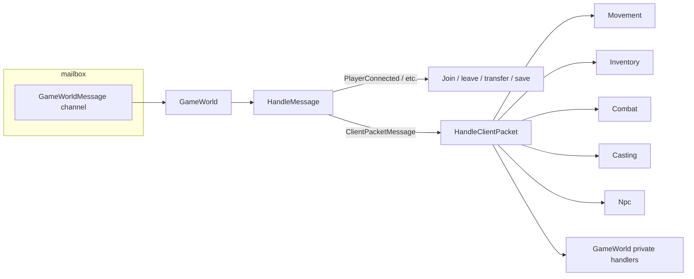
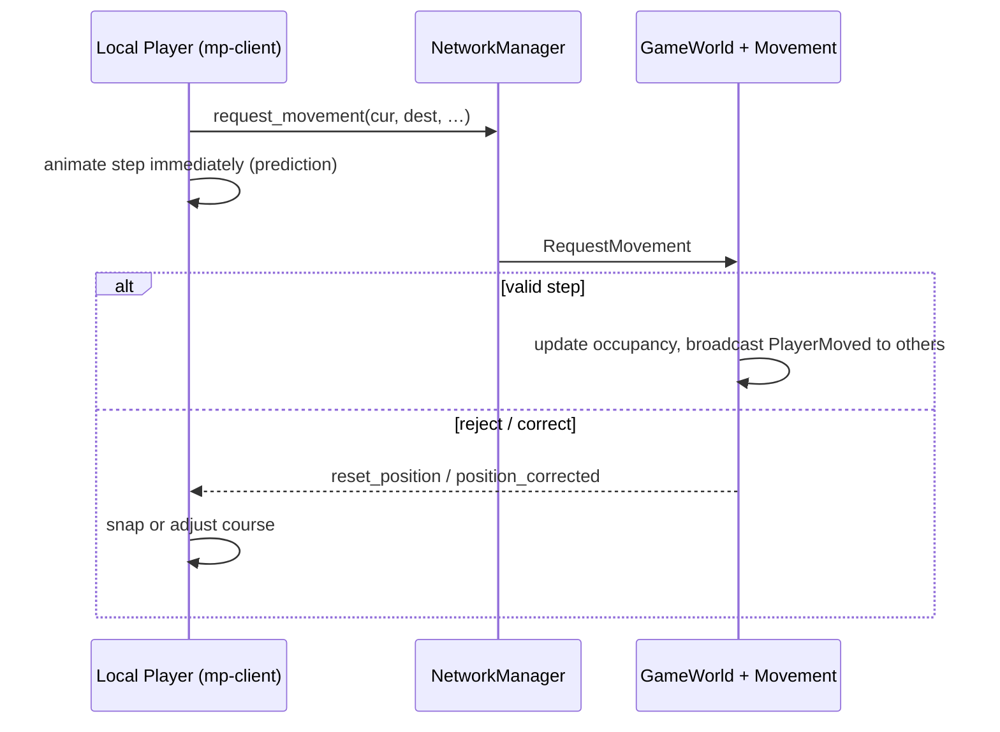

# Client–server sync

This document maps **server** gameplay dispatch in `GameWorld.cs` to **client** responsibilities, separates **client prediction** from **server-authoritative** logic, lists **anti-cheat / anti-hack guards**, and explains how **“Sync with server”** in the multiplayer UI affects testing.

For movement specifics (prediction, `request_movement`, `reset_position`), see [MOVEMENT_SYSTEM.md](./MOVEMENT_SYSTEM.md).

---

## Server: `GameWorld` message pipeline

Inbound work is serialized on the world worker: `ProcessPendingMessages` → `HandleMessage` → `HandleClientPacket` for gameplay packets.

`HandleClientPacket` in `GameWorld.cs` is the switchboard for every `ClientMessage` payload: ping, movement, teleport, stat changes, inventory, combat, casting, weather, world change, and debug/admin requests (summon, kill-all, etc.). Helpers (`Movement`, `Combat`, `Casting`, `Inventory`, `Npc`, `Ping`) enforce rules and broadcast results.

---

## Client prediction vs server authority

| Area | Client behavior | Server authority |
|------|-----------------|------------------|
| **Local player movement** | **Predictive**: the client sends `request_movement` and immediately animates the step; peers never drive your avatar for normal steps. | Grid position, occupancy, one-step validation, cadence, and visibility. |
| **Other players** | **Replicated only**: driven by `PlayerMoved` (and related snapshots). | Full authority. |
| **Monsters / NPCs** | Visual interpolation + events from server messages. | AI, HP, attacks, spawns. |
| **Combat hits** | Local animations; damage outcomes follow server messages. | Range, timing, damage, stunlock, knockback. |
| **Spells** | Local cast bar / FX; success or failure from server. | Cast start required, cast timing vs ping variance, AoE resolution. |
| **Inventory / ground items** | UI state updated from server-driven events. | Item creation, bag moves, equip, consume, drop, pickup. |
| **Stats** (speed, damage, range, …) | Local UI and `Player` reflect sliders and store. | Server stores authoritative values used for validation; see **Sync with server** below. |

---

## Anti-hack and validation guards (server)

These are enforced in helpers called from `GameWorld.HandleClientPacket`, not in the scene file alone.

| Guard | Where it lives | What it protects |
|-------|----------------|------------------|
| **Movement jump / stale packets** | `Movement.HandleRequestMovement` | Client `cur` must be within `MaxCellsJumpDistance` of the server cell; `dest` must be exactly **one** Chebyshev step from the **server** cell (not from a stale `cur`); duplicate “step to same cell” packets ignored. |
| **Stunlock vs movement** | Same | If stunlock timing is violated **and** client `cur` is more than one cell away from the server position → `reset_position` (with optional remaining stunlock). |
| **Movement cadence** | `GameWorldPlayer.CheckMovementSpeedViolation` | Time between movement requests vs allowed minimum; repeated violations → **server-forced paralysis** + warning message. |
| **Course correction vs blocked** | `Movement.HandleRequestMovement` | Blocked destination may slide to a side cell (`position_corrected`) when enabled; otherwise `reset_position`. |
| **Combat range** | `Combat.HandlePlayerAttackedMonsterRequest` / player | Attacks use **server** positions and range; out-of-range hits are dropped. |
| **Spell casting** | `Casting.HandleSpellCastRequest` | Requires prior `SpellCastStartRequest`; cast must not be too early vs cast speed + ping variance (`SpellCastFailed` on violation). |
| **Ping liveness** | `Ping.CheckPingVarianceAndDisconnectExcessive` | Missed ping interval or excessive RTT variance → disconnect (tab suspend / unstable link). |
| **World / teleport** | `HandleWorldChangeRequest` + `ResolveTeleportTargetNearPlayer` | Validated teleport targets near configured sources; arbitrary world IDs rejected. |

Spell timing and movement both use **`AntiHackTimingLagFactor`** / **`PingVariance`**-style inputs from `GameWorldPlayer` (see `Settings.json` and `GameWorldPlayer` construction in `GameWorld.cs`).

---

## “Sync with server” (`ServerDialog.tsx`)

**Location**: `multiplayer/mp-client/src/ui/dialogs/ServerDialog.tsx` (checkbox **“Sync with server”**, backed by `serverDialogStore.syncWithServer`).

**What it does when enabled (default)**  
`mp-client` `GameWorld` **sends** the corresponding protobuf requests when you change sliders in the Player / combat UI so the **server copy** of stats matches the client:

- Movement speed (base ms)  
- Attack speed, cast speed, attack range  
- Damage, stun duration  
- Attack type, allow dash attack  
- Attack mode, run mode  

**What it does when disabled**  
The local Phaser `Player` and UI still update **on the client**, but **no** `ChangePlayerMovementSpeedRequest`, `ChangePlayerAttackSpeedRequest`, etc. are sent. The server keeps its **last known** values for validation (movement cadence, attack range, damage, …).

**What it does *not* disable**  
- Movement packets (`request_movement`) still flow if you move.  
- Other gameplay requests (attacks, casts, inventory, ping) are unchanged by this flag.  
- Logout behavior: `ControlsDialog` uses `syncWithServer` so that when sync is off, **Log out** calls `disconnect()` instead of a graceful logout request.

### Using desync to test anti-hack

With **Sync with server** off you can **desync** client-displayed stats from server-authoritative stats:

- **Movement speed mismatch**: Client animates at one speed; server enforces cadence from **server** `MovementSpeedMs` → **movement speed violation** / paralysis if you click faster than the server allows.  
- **Attack range / damage / stun**: Client shows one range; server uses **server** values → hits may not apply or may behave differently than the UI suggests.  
- **Run mode / attack mode**: Local animation may not match what the server believes until you re-enable sync and send updates.

This is **intentional** for testing guards without modifying server code: you can observe `reset_position`, `position_corrected`, `PlayerParalyzed`, `SpellCastFailed`, and combat rejection logs.

---

## Action reference: server `HandleClientPacket` (summary)

The following maps `ClientMessage` cases from `GameWorld.cs` to typical authority. “Predicted” applies to **mp-client local player** only.

| Payload | Server handler | Client prediction (mp-client)? | Notes |
|---------|----------------|--------------------------------|--------|
| `PingRequest` | `Ping.HandlePingRequest` | N/A | Keeps RTT / variance for timing guards. |
| `RequestMovement` | `Movement.HandleRequestMovement` | **Yes** (local step) | Core prediction + anti-cheat. |
| `MakeServerCellOccupiedRequest` | `Movement.HandleMakeServerCellOccupiedRequest` | No | Debug / admin occupancy. |
| `PlayerTeleportRequested` | `Movement.HandlePlayerTeleportRequested` | Partial | Client may snap; server places + `PlayerTeleported`. |
| `ChangePlayerMovementSpeedRequest` | `Movement.HandleChangePlayerMovementSpeed` | Sync only | Affects server cadence + self `PlayerMovementStateChanged`. |
| `ChangePlayerAttackStunDurationRequest` | `GameWorld` | Sync only | Server stores stun duration. |
| `ChangePlayerAttackSpeedRequest` | `GameWorld` | Sync only | |
| `ChangePlayerCastSpeedRequest` | `GameWorld` | Sync only | Used in cast timing checks. |
| `ChangePlayerAttackTypeRequest` | `GameWorld` | Sync only | |
| `ChangePlayerAllowDashAttackRequest` | `GameWorld` | Sync only | |
| `ChangePlayerAppearanceRequest` | `GameWorld` | Local + sync | Server strips invalid gear; broadcasts appearance. |
| `CreateItemRequest` / bag / equip / unequip / consume | `Inventory.*` | No | Server authoritative inventory. |
| `PlayerItemDropRequested` / `PlayerItemPickupRequested` | `GameWorld` | No | Ground + bag state on server. |
| `ChangePlayerAttackRangeRequest` / `ChangePlayerAttackDamageRequest` | `GameWorld` | Sync only | Combat validation uses server. |
| `PlayerMovementStateChangeRequest` | `Movement.HandlePlayerMovementStateChange` | Sync only | Run/walk. |
| `PlayerAttackModeChangeRequest` | `Movement.HandlePlayerAttackModeChange` | Sync only | |
| `ChangePlayerIdleDirectionRequest` | `Movement.HandleChangePlayerIdleDirection` | Local + broadcast | Others get idle direction. |
| `WorldChangeRequest` | `HandleWorldChangeRequest` | Partial | May predict transfer; server validates teleport. |
| `SummonMonsterRequested` / `KillAllMonstersRequested` | `GameWorld` / `Combat` | No | Debug tools. |
| `SummonNpcRequest` / `KillAllNpcsRequest` | `Npc` | No | |
| `PlayerAttackedMonsterRequest` / `PlayerAttackedPlayerRequest` | `Combat` | Animate then wait for server | Server resolves damage. |
| `PlayerResurrectedRequest` | `HandlePlayerResurrectRequest` | No | Server picks free cell + HP. |
| `PlayerPickupRequested` / `PlayerBowStanceRequested` | `GameWorld` | No | Lockout + broadcast. |
| `SpellCastStartRequest` / `SpellCastCancelRequest` / `SpellCastRequest` | `Casting` | Cast bar local; result authoritative | `SpellCastFailed` on violations. |
| `WeatherChangeRequest` | `HandleWeatherChangeRequest` | Local weather optional | Server broadcasts `WeatherChanged` to all in world. |

---

## `GameWorld.ts` (mp-client): networking responsibilities

The multiplayer scene:

- Subscribes to **server → client** events (`PLAYER_MOVED_RECEIVED`, `POSITION_CORRECTED_RECEIVED`, `RESET_POSITION_RECEIVED`, combat, spells, inventory, …).  
- Applies **`pendingCourseCorrections`** before `player.update` so server corrections merge cleanly with prediction.  
- Uses **`serverDialogStore.state.syncWithServer`** in **control** listeners to **gate** outbound stat requests (see above).  
- Tracks **`selfPlayerId`**, **`playersById`**, world transfer, and initial state from `InitialGameWorldState`.

For file-level detail, see [MOVEMENT_SYSTEM.md](./MOVEMENT_SYSTEM.md) and server threading docs.
