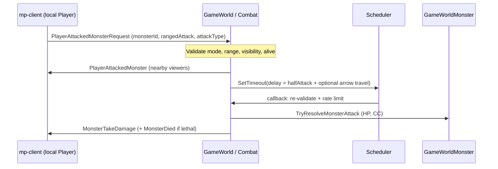
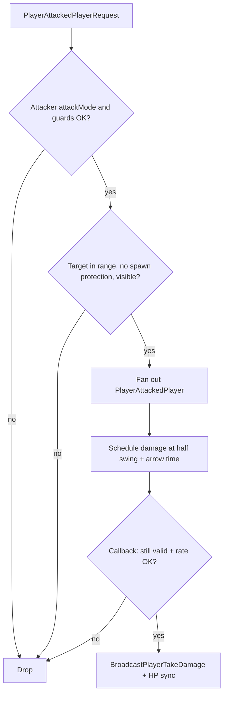

# Combat system (melee & ranged weapon attacks)

This document describes **non-spell** combat: player weapon attacks (melee and bow) and **monster melee/ranged swings** resolved on the server, plus how `multiplayer/mp-client` requests hits. **Spells, ground effects, and spell-shaped damage** are out of scope (they reuse some of the same `AttackType` plumbing but are handled in `Casting.cs` and related paths).

**Code references**: authoritative logic in `multiplayer/server/Helpers/Combat.cs`, `MonsterVisibility.cs`, `MonsterChase.cs`, `GameWorldMonster.cs`, `GameWorldPlayer.cs`; client requests in `multiplayer/mp-client` (`Player.ts`, `NetworkManager.ts`).

---

## Concepts shared by players and monsters

### `AttackType` (hit mode)

Defined in `multiplayer/server/Commons.cs` and mirrored on the client as `AttackType` in `mp-client/src/Types.ts`:

| Value | Name | Effect (high level) |
|------|------|---------------------|
| `0` | `NoInterrupt` | Damage only; does not bump interrupt counters or stunlock players; monsters still take HP loss. |
| `1` | `Interrupt` | Same take-damage presentation as stun for many targets, but **no** combat stunlock window on players; on monsters, an `Interrupt` hit from a player **cancels pending damage** from the monster’s current swing (`ClearPendingAttackDamageFromPlayerInterrupt`). |
| `2` | `Stun` | Applies stunlock (players: packet stun ms + movement gating; monsters: `TryApplyStunlock` with attacker’s stun duration). |
| `3` | `Knockback` | Push one grid cell away from attacker when the destination is free; otherwise degrades to stun-style behavior. Knockback animation length uses `timings.knockbackTimeMs` in `Settings.json`. |

Monster-on-player hits **downgrade** stun/knockback to `Interrupt` if the player already has an active combat stunlock window (so chain-stunlock from rapid hits is avoided).

### Distance and range

- **Grid metric**: Chebyshev distance via `Location.GetDistance` (same as other world docs).
- **Player weapon reach**: server uses `GameWorldPlayer.AttackRange` (cells). **Hit validation** allows targets at distance **≤ `AttackRange + 1`** (same tolerance as monster swings vs players).
- **Monster melee reach**: `GameWorldMonster.AttackRangeCells` from `Monsters.json` (default 1 when omitted). Chase uses this range to start an attack; damage checks use **`AttackRangeCells + 1`** for the actual hit.

### Ranged (bow / monster `rangedAttack`) vs melee timing

- **Players**: `PlayerAttackedMonsterRequest` / `PlayerAttackedPlayerRequest` carry `rangedAttack`. Damage is **not** instant: the server schedules a callback after  
  **`AttackSpeedMs / 2`** plus, when `rangedAttack` is true, **`Projectile.ComputeTravelTime`** from attacker cell to target cell at `timings.arrowSpeed` (pixels/sec; 32 px per cell). See `Combat.ComputePlayerAttackDelayMs` and `Projectile.cs`.
- **Monsters**: `BeginAttack` sets damage time to half of `AttackSpeedMs`, plus the same arrow travel time when `RangedAttack` is true. Animation end is still full `AttackSpeedMs`.

Visual sync (`PlayerAttackedMonster`, `PlayerAttackedPlayer`, `MonsterAttacked`, `MonsterAttackedMonster`) is broadcast **immediately**; damage applies on the delayed tick.

---

## Player vs monster (PvM)

### Client (`mp-client`)

- Only the **local** player sends attack requests when entering attack animation (`Player.startAttack`).
- **Combat mode** (`attackMode`): starts `MeleeAttack` or `BowAttack` from equipped weapon; sends `sendPlayerAttackedMonster(monsterId, ranged, attackType)`. `ranged` is true when `weaponType === WeaponType.BOW`.
- **Peace mode**: `attack()` uses bow **stance** only (`startBowStance`) — that sends `PlayerBowStanceRequested`, **not** a damage request. The server rejects real attacks unless `AttackMode` is on (see below).

### Server: `Combat.HandlePlayerAttackedMonsterRequest`

**Preconditions (silent reject if unmet):**

- Attacker alive, **`AttackMode` true**, not in pickup/bow-stance lockout.
- `monsterId` valid, monster exists, not dead, not invisible.
- **`IsMonsterInRange`**: target monster id must be in the attacker’s server-side visibility set (`monstersInRange`).
- Chebyshev distance from player to monster **≤ `AttackRange + 1`** at accept time.
- Attacker **spawn protection** is cleared when an attack is accepted (`Spawn.DisableSpawnProtectionAndNotify`); attacker invisibility is broken.

**Flow:**

1. If `AttackType.Interrupt`, monster **`ClearPendingAttackDamageFromPlayerInterrupt`** (cancels damage instant for monster’s current swing; animation may still run).
2. **`BroadcastPlayerAttackVisual`**: nearby players get `PlayerAttackedMonster` (direction from server grid, `attackSpeedMs`, `rangedAttack`, `attackType`, positions).
3. **Schedule** delayed `ApplyPlayerAttackToMonster` with captured `InterruptedCount` and session; callback re-validates range, visibility, alive state, and **`TryRecordPlayerAttackDamageDelivery`** (anti-speed-hack cadence vs effective `AttackSpeedMs`, lag factor, ping variance).

**Damage:** `ApplyPlayerAttackToMonster` → `TryResolveMonsterAttack` (HP, optional stunlock/knockback on monsters) → `MonsterVisibility.BroadcastMonsterTakeDamage` → on death, `BroadcastMonsterDied`. If HP remains, **`SetAggroFromDamagePlayerAttacker`** (neutral/hostile monsters retarget the player; friendly never aggro players from damage rules).

---

## Player vs player (PvP)

### Client

Same as PvM: `sendPlayerAttackedPlayer(targetPlayerId, ranged, attackType)` from `startAttack` when the target implements player combat id.

### Server: `Combat.HandlePlayerAttackedPlayerRequest`

**Extra / different guards:**

- Target must be **connected**, not dead, **`IsPlayerInRange`**, not self.
- **Target spawn protection**: attack rejected (attacker protection is cleared when their attack is accepted).
- Target not invisible.

**Damage:** `ApplyPlayerAttackToPlayer` → `MonsterVisibility.BroadcastPlayerTakeDamage` (attacker player id, damage = attacker’s `Damage`, resolved `attackType`, stun/knockback fields). Authoritative HP update and death handling go through **`BroadcastCombatDamageToPlayer`** (interrupt lockouts, stunlock registration, `HpUpdated`, `HandlePlayerDeath`).

**Cadence:** Same delayed callback and **`TryRecordPlayerAttackDamageDelivery`** as PvM.

---

## Monster vs player (MvP)

No client request: **AI** drives `GameWorldMonster` chase/attack.

1. **`MonsterChase`**: Hostile monsters auto-pick nearby players (in `playersInRange`, within `ChaseDistanceCells`, not dead/protected/invisible). Neutral monsters **do not** auto-chase players until damaged by one (`SetAggroFromDamagePlayerAttacker`). Friendly monsters do not take player damage aggro in the same way (see `SetAggroFromDamagePlayerAttacker`).
2. When the chase target cell is within **`AttackRangeCells`**, **`TryBeginMeleeAttackAgainstChaseTarget`** calls **`BeginAttack`** → broadcasts **`MonsterAttacked`** with `rangedAttack` and target player id.
3. At **`attackDamageDealDue`** (half swing + optional projectile time), **`TryDealDamageToPlayerTarget`** rolls **`AttackDamageMin..AttackDamageMax`**, resolves `AttackType` / knockback like PvP, and sends **`BroadcastPlayerReceiveDamage`** (monster id as source).

If a player hits the monster with **`Interrupt`** during the wind-up, **`attackDamageDealDue`** is cleared so **no damage** fires for that swing.

---

## Monster vs monster (MvM)

Also server-only.

1. **`MonsterChase`** picks monster targets when **`CanAutoTargetMonsters`**: **Hostile** monsters seek **Friendly** monsters; **Friendly** seek **Hostile**; **Neutral** does not auto-target monsters (retaliation uses damage aggro rules in `SetAggroFromDamageMonsterAttacker`).
2. **`BeginAttack`** with monster target broadcasts **`MonsterAttackedMonster`**.
3. On damage tick, **`Combat.ApplyMonsterAttackToMonster`**: roll damage, reuse **`TryResolveMonsterAttack`** with attacker’s `AttackType` and `StunDurationMs`, then **`BroadcastMonsterTakeDamageByMonster`** (includes `attackerMonsterId`). Death uses the same `MonsterDied` path as PvM.

---

## Configurations (what you can tune)

### Player (server / persistence)

On `GameWorldPlayer`: authoritative **`Damage`**, **`AttackRange`**, **`AttackSpeedMs`** (with temp-effect modifiers), **`AttackStunDurationMs`**, persisted **`AttackType`** preference (UI / `ChangePlayerAttackTypeRequest` — the **packet still carries** `attackType` per swing). **`AllowDashAttack`** is mirrored for UI; dash hits are separate (below).

### Monsters (`Monsters.json` + defaults in settings)

Per catalog entry (see `MonsterConfig` in `Config.cs`): **`attackRange`**, **`attackSpeed`**, **`attackDamageMin` / `attackDamageMax`**, **`attackRecoveryTime`**, **`attackType`**, **`attackStunDuration`**, **`rangedAttack`**, **`allegiance`** (`Hostile` / `Neutral` / `Friendly`), chase distances, HP, etc.

### Global timings (`server/Config/Settings.json`)

- **`timings.arrowSpeed`**: projectile travel for **player and monster** ranged swings (and spells elsewhere).
- **`timings.knockbackTimeMs`**: client knockback duration for authoritative knockbacks.
- **`timings.antiHackTimingLagFactor`** and ping variance: folded into **`ComputeMinRequiredTimeMs`** for attack delivery rate limits.

---

## Visibility and “in range” for player-initiated attacks

- **`IsMonsterInRange` / `IsPlayerInRange`** reflect **server view-radius tracking**, not a fresh world query. If the client shows a target but the server has not yet added that id to the set, the request is dropped.
- Damage broadcasts (`MonsterTakeDamage`, `PlayerTakeDamage`, etc.) go to **players near the target cell** via `PlayerSpatialGrid.GetNearbyPlayers`.

---

## Dash attacks (immediate hit)

`Combat.HandlePlayerDashAttackAfterMovement` runs after an accepted movement that encodes **`DashAttack`** + `AttackType` + target id. It **applies damage immediately** (no scheduler delay), validates range from **post-move** position, then **`ClearLastPlayerAttackDamageDeliveryTime`** so the next normal swing does not inherit the rate limiter’s last timestamp.

---

## Summary table

| Matchup | Initiator | Request / trigger | Damage packet path |
|--------|-----------|-------------------|---------------------|
| PvM | Player | `PlayerAttackedMonsterRequest` | `MonsterTakeDamage` |
| PvP | Player | `PlayerAttackedPlayerRequest` | `PlayerTakeDamage` |
| MvP | Monster AI | `TryDealDamageToPlayerTarget` | `PlayerReceiveDamage` |
| MvM | Monster AI | `ApplyMonsterAttackToMonster` | `MonsterTakeDamageByMonster` |

For all player-involved deliveries, non-`NoInterrupt` hits increment **`InterruptedCount`** and can apply **combat stunlock** on the victim; scheduled player attack callbacks **abort** if `InterruptedCount` changed since scheduling—so a stunlocking hit mid-wind-up can cancel a pending player swing’s damage.
