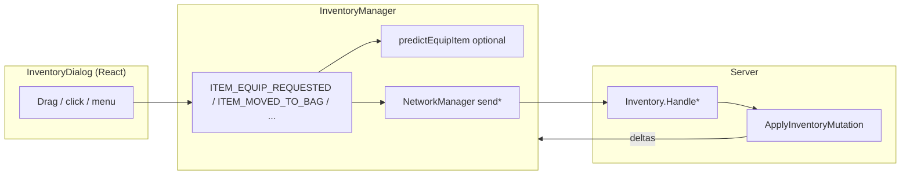
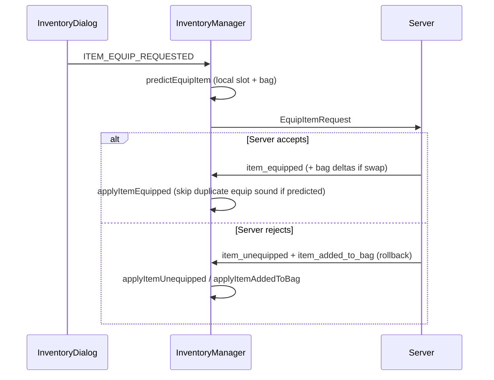
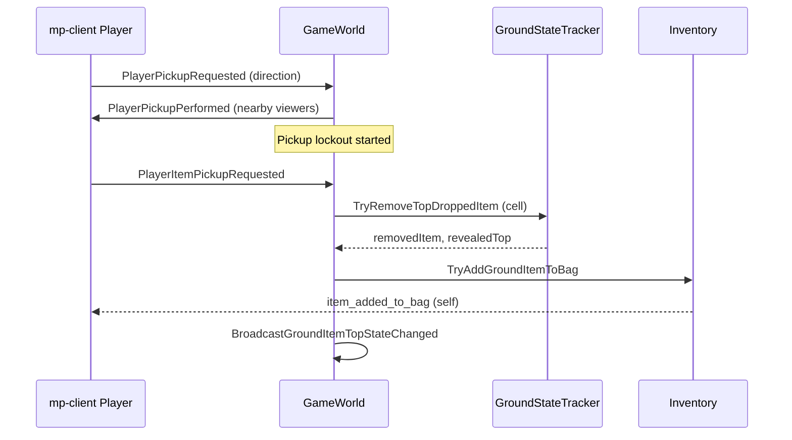

# Inventory and items system

This document describes how **items are created**, how **bag and equipment** stay in sync between **mp-client** (`multiplayer/mp-client`) and the **server**, and how **dropping and picking up** ground items works. Ground visibility is summarized here; per-player ground sync details live in [SERVER_VISIBILITY_TRACKING.md](./SERVER_VISIBILITY_TRACKING.md). Client/server request classification also appears in [CLIENT_SERVER_SYNC.md](./CLIENT_SERVER_SYNC.md).

**Primary code:** `multiplayer/server/Helpers/Inventory.cs`, `multiplayer/server/Utils/InventoryManager.cs`, `multiplayer/server/World/Game/GameWorld.cs`, `multiplayer/server/Utils/GroundStateTracker.cs`, `multiplayer/server/Helpers/GroundStateVisibility.cs`, `multiplayer/mp-client/src/utils/InventoryManager.ts`, `multiplayer/mp-client/src/ui/dialogs/InventoryDialog.tsx`, `multiplayer/mp-client/src/utils/NetworkManager.ts`, `multiplayer/mp-client/src/game/objects/Player.ts`, `multiplayer/mp-client/src/game/objects/GroundItem.ts`.

---

## Concepts

| Concept | Meaning |
|--------|--------|
| **Item catalog** | Server loads `Items.json` (`ItemConfig`). On connect, rows are sent in `InitialState.items_directory` so mp-client can render and validate types (stackable, consumable, blocked slots, gender, effects, weapon type). |
| **Item instance** | A row in the bag or on a body slot: `item_id`, unique `item_uid`, optional `quantity` (stacks), `bag_x` / `bag_y` / `bag_z_index` for UI, optional effect overrides. |
| **Authoritative state** | The server’s `InventoryManager` on `GameWorldPlayer` owns bag + equipped maps. mp-client **mirrors** deltas from the server; any “prediction” is UX-only until confirmed or rolled back. |
| **Ground stack** | Per map cell, dropped items form a stack. Only the **top** entry is visible to clients in range; pickup removes the top and may reveal the next. |

---

## Item generation

### Initial loadout (server)

When a player’s `InventoryManager` is constructed, `SeedInitialLoadout()` equips a fixed set of catalog ids (weapon, armor pieces, cape, etc.) so new sessions start with gear already on body slots—not in the bag. UIDs are allocated with `CreateItemUid()` (random `long` from GUID bytes).

### Runtime create (client request → server)

`CreateItemRequest` (`item_id`, optional `effect_overrides`) is handled by `Inventory.HandleCreateItemRequest` → `TryCreateItem`:

- Unknown `item_id` → request ignored.
- If the catalog row is **stackable** and the bag already holds that `item_id`, **quantity** on the existing row increments (capped) and `item_added_to_bag` reflects the updated stack.
- Otherwise a **new** bag row is appended with `quantity` 1, new `item_uid`, and default bag placement (null coordinates; z-order normalized).

In mp-client, the admin **Item** dialog (`ItemDialog.tsx`) emits `ITEM_CREATE_REQUESTED`, which becomes `sendCreateItemRequest`. There is **no** client-side prediction for create: the bag updates when `item_added_to_bag` arrives.

### Not covered here

Monster defeat and other world systems in this repo do **not** currently grant items by a separate loot pipeline in the paths documented above; new instances enter the economy via **initial loadout**, **create requests**, or **ground pickup** after a **drop**.

---

## Equipping and unequipping

### Server rules (`TryEquipItem` / `TryUnequipItem`)

- **Equip** (`EquipItemRequest`): item must be in the **bag**, exist in the catalog, not be `misc`, and satisfy **gender** if the row is gender-locked. Target slot is derived from `item_type`, with **rings** using `ring-left` / `ring-right` from the request or default fill order.
- **Blocking**: Equipping may **unequip** other slots first—either because the new item’s `blocked_item_slots` lists them, or because an already-equipped item’s `blocked_item_slots` conflicts with the new item’s type (e.g. weapon vs shield). Displaced pieces go back to the bag in one mutation.
- **Slot swap**: If the target slot already holds an item, that item returns to the bag and the new item takes the slot.
- **Unequip** (`UnequipItemRequest`): slot + `item_uid` must match; optional `bag_x` / `bag_y` override remembered UI coordinates. Item is appended to the bag and z-indices normalized.

After gender changes via **`ChangePlayerAppearanceRequest`**, the server calls `UnequipItemsInvalidForCurrentGender` so incompatible gear leaves body slots authoritatively (in addition to any unequip requests the client may send from the appearance UI).

### Who receives equip/unequip packets

`ApplyInventoryMutation` sends **self** deltas (`item_added_to_bag`, `item_removed_from_bag`, `item_moved_in_bag`, `item_equipped`, `item_unequipped`). For **equip** and **unequip**, **`item_equipped` / `item_unequipped` are also sent to nearby players** when the slot is in `VisibleAppearanceSlots` (weapon, shield, armor, hauberk, leggings, boots, helmet, cape, accessory). **Rings and necklace** still sync to the owning client but are **not** in that set, so other players do not get those messages for appearance.

### mp-client: Inventory dialog and `InventoryManager`

The React **InventoryDialog** drives drag/drop, double-click equip, context actions, etc., via **EventBus** events consumed by `InventoryManager` (see event names in `EventNames.ts`).

### Client prediction vs server confirmation

| Action | Client prediction | Server |
|--------|-------------------|--------|
| **Equip from bag** | **Yes.** `predictEquipItem` immediately moves the item to the slot, preemptively unequips blockers locally, plays sounds, and tags UIDs so duplicate sounds are suppressed when the server echoes the same change. | **Authoritative.** On failure (invalid item, gender, misc, etc.), `SendEquipRollbackIfNeeded` sends `item_unequipped` for the **predicted** slot plus `item_added_to_bag` so the client restores the item still in the bag on the server. |
| **Unequip to bag** | **No** dedicated mirror of equip’s prediction path; UI may initiate a move, but authoritative unequip + bag add comes from server messages. | **Authoritative.** |
| **Move within bag / z-order** | **Partial.** Bag coordinates update locally, then `MoveItemInBagRequest` syncs. Bring-to-front in the UI reorders locally; persistence of z-order on the server is tied to **`MoveItemInBag`** (which always re-append-normalizes order). | **Authoritative** for final positions and z-index. |
| **Consume misc** | **Sound only** may play before the request; quantity/removal follows server. | **Authoritative** (`TryConsumeItem`). |
| **Create item** | No | **Authoritative** |
| **Drop / pickup** | Drop: **sound** deferred until `item_removed_from_bag` confirms; no ground prediction. Pickup: local **animation** only; bag/ground state from server. | **Authoritative** |

---

## Dropping items to the ground

1. mp-client: drag from the inventory to the world (or equivalent) → `ITEM_DROP_TO_GROUND_REQUESTED` → `sendPlayerItemDropRequested(item_uid)`; the drop **sound** is queued until the server confirms bag removal.
2. Server: `HandlePlayerItemDropRequested` (dead players ignored):
   - `Inventory.TryRemoveBagItemForGroundDrop` removes the bag row and sends **`item_removed_from_bag`** to the player.
   - `groundStateTracker.TryAddDroppedItem` places **`GroundItemState`** on the player’s **current cell** (same `item_uid` and full stack `quantity`).
   - `GroundStateVisibility.BroadcastGroundItemTopStateChanged` updates viewers’ top-of-cell state.

**Note:** Comments in `GameWorld` warn that bag removal and ground insertion are **not one atomic transaction**. If a later step fails after an earlier one succeeds, items can be lost—documented as a known hazard for future changes.

mp-client **GroundItem** sprites follow **authoritative** `ground_states_*` data from `NetworkManager`, not a separate client loot tracker.

---

## Picking up ground items

### Client flow

On **left-click** on the local player’s own cell, `Player.requestPickUp()` (when not blocked by combat, movement, stun, etc.):

1. Sends **`PlayerPickupRequested`** with the current **facing direction** (for animation sync).
2. Sends **`PlayerItemPickupRequested`** (empty payload) in the **same** call.

Locally the player enters **PickUp** animation state; **remote** players receive **`PlayerPickupPerformed`** from the server when the pickup animation request is accepted.

### Server flow

- **`HandlePlayerPickupRequested`**: Validates direction, sets facing, starts pickup **action lockout** (used to gate other actions), broadcasts `PlayerPickupPerformed` to nearby sessions (observers see the animation).
- **`HandlePlayerItemPickupRequested`**: If the player is alive, removes the **top** ground item on that cell via `TryRemoveTopDroppedItem`, then **`Inventory.TryAddGroundItemToBag`** (stack merge by `item_id` when stackable). Broadcasts ground top state change for visibility.

So **transfer to the bag happens when the item-pickup message is processed**, in the same interaction as starting the pickup animation (two separate protocol messages). There is **no** separate “pickup completed” message in the current mp-client `requestPickUp` path.

If **`TryAddGroundItemToBag`** fails after the ground item was removed, the same **non-atomic** caveat as drops applies.

---

## Quick reference: messages

| Client → server | Handler | Purpose |
|-----------------|---------|---------|
| `CreateItemRequest` | `Inventory.HandleCreateItemRequest` | Add/stack item in bag |
| `MoveItemInBagRequest` | `Inventory.HandleMoveItemInBagRequest` | Bag position + z-order |
| `EquipItemRequest` | `Inventory.HandleEquipItemRequest` | Bag → body |
| `UnequipItemRequest` | `Inventory.HandleUnequipItemRequest` | Body → bag |
| `ConsumeItemRequest` | `Inventory.HandleConsumeItemRequest` | Use consumable misc |
| `PlayerItemDropRequested` | `GameWorld.HandlePlayerItemDropRequested` | Bag → ground stack |
| `PlayerPickupRequested` | `GameWorld.HandlePlayerPickupRequested` | Animation + lockout + observer sync |
| `PlayerItemPickupRequested` | `GameWorld.HandlePlayerItemPickupRequested` | Top ground item → bag |

| Server → mp-client (inventory / ground) | Typical role |
|----------------------------------------|--------------|
| `item_added_to_bag` / `item_removed_from_bag` / `item_moved_in_bag` | Self bag mirror |
| `item_equipped` / `item_unequipped` | Self + nearby (visible slots only for others) |
| Ground state bulk/delta packets | Top item per cell in view (`NetworkManager` → `GroundItem`) |

---

## Related documentation

- [SERVER_VISIBILITY_TRACKING.md](./SERVER_VISIBILITY_TRACKING.md) — ground item ids in `groundItemsInRange` and sync after movement.
- [CLIENT_SERVER_SYNC.md](./CLIENT_SERVER_SYNC.md) — inventory and ground requests marked **not** locally authoritative.
- [SERVER_CONFIGURATION.md](./SERVER_CONFIGURATION.md) — item catalog and timings (e.g. pickup animation duration in `Settings.json`).
