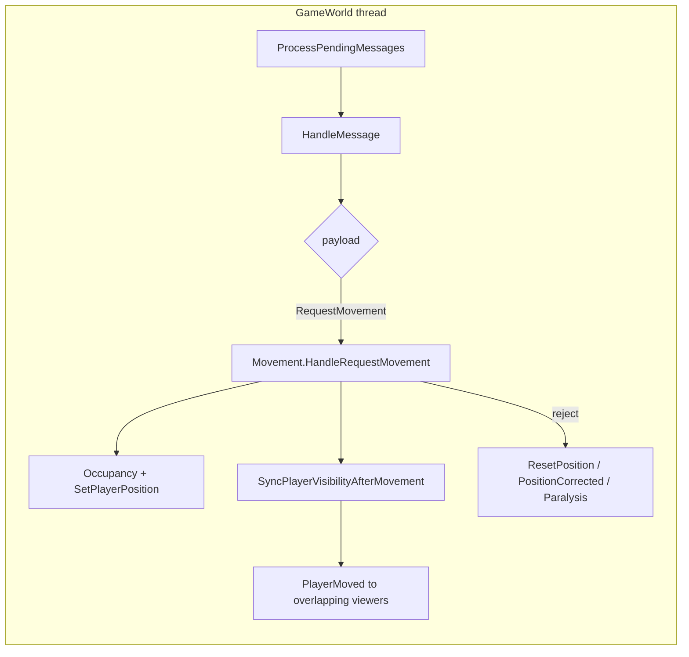
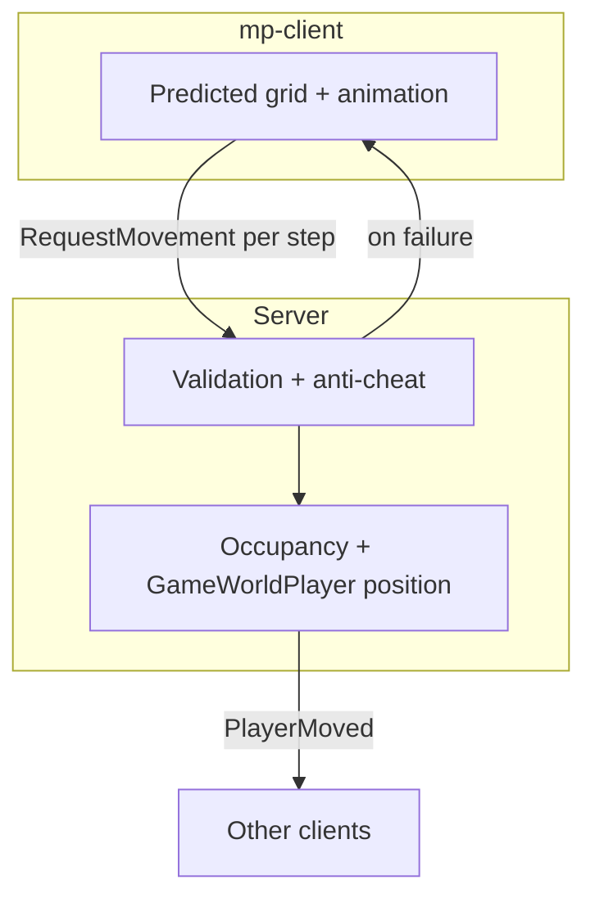

# Movement system

This document describes player movement on the **server** (`multiplayer/server`) and the **networked client** (`multiplayer/mp-client`): authority, client-side prediction, replication to other players, and reconciliation when the server rejects a step. Server routing starts in `GameWorld.cs`; validation and broadcasts live in `Movement.cs`.

---

## Roles: authority vs prediction

| Concern | Server (`multiplayer/server`) | Networked client (`multiplayer/mp-client`) |
|--------|--------------------------------|---------------------------------------------|
| **Grid position & occupancy** | Authoritative: `GameWorldOccupancyTracker`, `GameWorldPlayer.PosX/Y`, spatial grids | Predicted locally for the **local** player; must match server rules or receive rollback |
| **One step per request** | Enforced: destination must be exactly one Chebyshev step from the server cell | Sends `request_movement` with `curX/curY` → `destX/destY`, then moves immediately (`super.move`) |
| **Animation / facing** | Derives facing from the validated step; broadcasts speed/run mode to others | Local animation runs immediately; remotes driven by `PlayerMoved` |
| **Other players** | Broadcasts `PlayerMoved` to overlapping viewers (not to the mover) | Applies `PlayerMoved` to **remote** entities only; local player ignores self |
| **Correction** | Sends `reset_position`, `position_corrected`, or paralysis on violation | `Player.resetPosition` / correction paths snap to server |

---

## Server: from `GameWorld` to `Movement`

Inbound gameplay packets are drained on the world worker thread. `ClientPacketMessage` is dispatched from `HandleMessage` → `HandleClientPacket`.

```621:637:multiplayer/server/World/Game/GameWorld.cs
    private void HandleClientPacket(ClientPacketMessage message) {
        if (!playersBySessionId.TryGetValue(message.SessionId, out var playerConnection)) {
            Console.WriteLine($"[GameWorld:{id}] Received packet for unknown session '{message.SessionId}'.");
            return;
        }

        switch (message.Message.PayloadCase) {
            case ClientMessage.PayloadOneofCase.PingRequest:
                HandlePingRequest(playerConnection, message.Message.PingRequest);
                break;
            case ClientMessage.PayloadOneofCase.RequestMovement:
                if (!IsRequestForCurrentWorld(message.Message.RequestMovement.GameWorldId)) {
                    break;
                }
                Movement.HandleRequestMovement(gameWorldRef, playerConnection, message.Message.RequestMovement);
                break;
```

Related movement-adjacent payloads on the same switch include `PlayerTeleportRequested`, `ChangePlayerMovementSpeedRequest`, `PlayerMovementStateChangeRequest`, `ChangePlayerIdleDirectionRequest`, and admin `MakeServerCellOccupiedRequest` (see the same method for the full list).

### What `Movement.HandleRequestMovement` does (authoritative core)

Implementation: `multiplayer/server/Helpers/Movement.cs`.

1. **Guards**: dead players, pickup/bow lockout, spawn protection (cleared on first move), server-forced paralysis → `reset_position` without mutating the world.
2. **Stunlock**: if combat stunlock timing is violated and the client’s reported `cur` cell is far from the server cell (Chebyshev &gt; 1), send `reset_position` with optional remaining stunlock ms.
3. **Anti-teleport**: client `cur` must be within `MaxCellsJumpDistance` of the server cell; `dest` must be exactly **one** Chebyshev step from the **server** cell (not from `cur`). Duplicate or late packets (`serverToDest == 0`) are ignored.
4. **Occupancy**: if `dest` is blocked, optional **course correction** slides to adjacent free cells; otherwise `reset_position`.
5. **Cadence**: `CheckMovementSpeedViolation` uses request spacing; repeated violations can apply server paralysis and chat warning.
6. **Apply**: free previous cell, occupy destination, `SetPlayerPosition` (spatial grid + player coordinates), `SyncPlayerVisibilityAfterMovement`, facing from step, ground effects, dash attack handling.

Visibility sync sends `PlayerMoved` to **nearby viewers** who could see both old and new cells; it does **not** echo the step back to the mover—the client already stepped. Newly entered players receive bulk snapshots via `PlayersEnteredRange` / `SendPlayersSnapshotsBulk`.

---

## Client: prediction and sync (`mp-client`)

### Prediction (local player)

`mp-client` overrides `Player.move()` to send `request_movement` **before** applying the step. If the server later rejects the move, the client snaps back via `reset_position` / `position_corrected`.

```2273:2310:multiplayer/mp-client/src/game/objects/Player.ts
    /**
     * Overrides move to send `request_movement` before moving to the next cell.
     */
    protected override move(direction: Direction): void {
        if (this.dead) {
            return;
        }
        if (this.isLocalPlayer && this.isParalyzed()) {
            return;
        }
        if (this.isLocalPlayer && this.isStunlocked()) {
            return;
        }
        const [dx, dy] = getDirectionOffset(direction);
        const nextX = this.worldX + dx;
        const nextY = this.worldY + dy;
        if (this.isLocalPlayer) {
            const dashAttackMonsterId =
                this.dashMode && this.attackTarget && isMonsterCombatTarget(this.attackTarget)
                    ? this.attackTarget.getMonsterId()
                    : undefined;
            const dashAttackPlayerId =
                this.dashMode && this.attackTarget && !isMonsterCombatTarget(this.attackTarget)
                    ? this.attackTarget.getPlayerId()
                    : undefined;
            getNetworkManager(this.scene.game)?.requestMovement(this.worldX, this.worldY, nextX, nextY, {
                dashAttack: dashAttackMonsterId !== undefined || dashAttackPlayerId !== undefined,
                monsterId: dashAttackMonsterId,
                playerId: dashAttackPlayerId,
                attackType: dashAttackMonsterId !== undefined || dashAttackPlayerId !== undefined ? this.attackType : undefined,
            });
            const gameWorldScene = this.scene as GameWorldScene;
            if (gameWorldScene.tryBeginTeleportAt(nextX, nextY)) {
                return;
            }
        }
        super.move(direction);
    }
```

`NetworkManager.requestMovement` encodes `ClientMessage` with `gameWorldId` so stale cross-world packets can be ignored server-side (`IsRequestForCurrentWorld` in `GameWorld.cs`).

### Remote players (server-replicated)

`ServerMessage.player_moved` is decoded in `NetworkManager` and surfaced to the scene. `GameWorld.handlePlayerMoved` **ignores** the local player id so the local avatar is never driven by replication for normal steps; it animates others from `cur` → `dest` (or snaps on teleport).

```2667:2726:multiplayer/mp-client/src/game/scenes/GameWorld.ts
    private handlePlayerMoved(data: PlayerMovedEventData): void {
        if (data.playerId === this.selfPlayerId || !this.player || !this.mapManager || this.loadingMap) {
            return;
        }

        const movementSpeedMs = data.movementSpeedMs;
        const runningMode = data.runningMode;
        let otherPlayer = this.playersById.get(data.playerId);
        // ... create or update otherPlayer ...

        if (data.teleport) {
            otherPlayer.snapRemoteToAuthoritativeCell(data.destX, data.destY);
        } else {
            otherPlayer.startMovementStep(data.curX, data.curY, data.destX, data.destY, data.dashAttack);
        }
    }
```

### Keeping in sync

| Mechanism | Purpose |
|-----------|---------|
| **Successful step** | Server updates its grid; client already moved; no self `PlayerMoved` required |
| **`reset_position` / `position_corrected`** | Forced alignment when validation fails, blocked tile, jump/cadence issues, or course correction |
| **`PlayerMoved`** | Remote players stay aligned and animated with authoritative `cur`/`dest`, speed, run mode |
| **Join / reconnect** | `InitialState`, `PlayersEnteredRange`, `SendInitialGameWorldState` (see `Spawn` helpers) establish baseline positions |
| **Teleport** | Server `HandlePlayerTeleportRequested` + `PlayerTeleported` to the actor; `PlayerMoved` uses teleport flag for observers |

---

## Diagrams

### Server packet dispatch (overview)



### Client: one predicted step

```mermaid
sequenceDiagram
    participant P as mp-client Player
    participant N as NetworkManager
    participant S as Server GameWorld
    participant M as Movement

    P->>N: requestMovement(cur, dest)
    P->>P: super.move() (predict)
    N->>S: ClientMessage RequestMovement
    S->>M: HandleRequestMovement
    alt valid
        M->>M: occupy dest, sync visibility
        Note over P: No self PlayerMoved; prediction stands
    else invalid
        M-->>P: reset_position / position_corrected
        P->>P: resetPosition / apply correction
    end
```

### Authority boundary



---

## File index

| Area | Primary files |
|------|----------------|
| Server routing | `multiplayer/server/World/Game/GameWorld.cs` (`HandleClientPacket`) |
| Server movement logic | `multiplayer/server/Helpers/Movement.cs` |
| Client send | `multiplayer/mp-client/src/utils/NetworkManager.ts` (`requestMovement`) |
| Client prediction | `multiplayer/mp-client/src/game/objects/Player.ts` (`move` override) |
| Client remotes | `multiplayer/mp-client/src/game/scenes/GameWorld.ts` (`handlePlayerMoved`) |

---

## Related docs

- `multiplayer/docs/SERVER_THREADING_AND_PACKET_FLOW.md` — worker thread and mailbox behavior for `GameWorld`.
