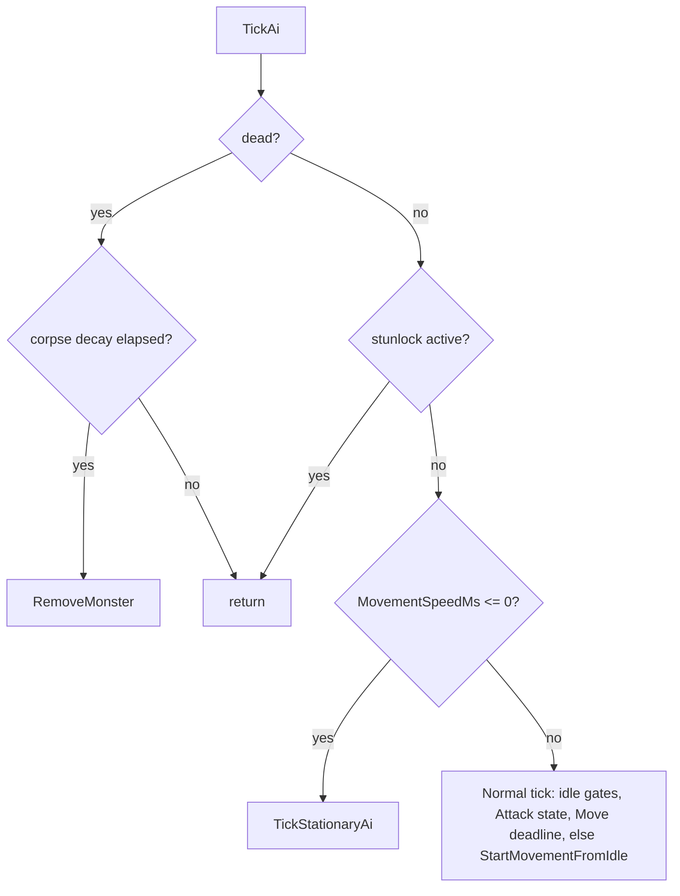
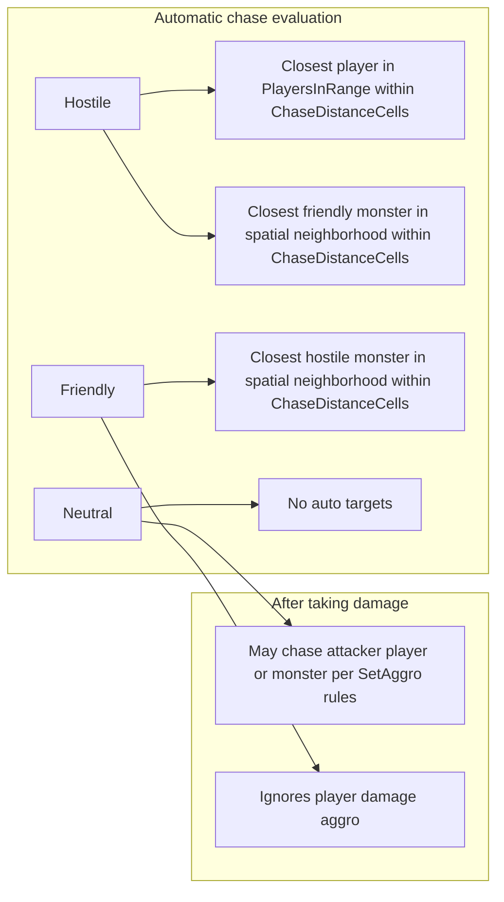

# Server monster AI

This document describes how **server-authoritative** monster behavior is driven in `GameWorldMonster` (`multiplayer/server/World/Game/GameWorldMonster.cs`), including wander, chase, spell casts, melee/ranged swings, stunlock, and death. **Targeting policy** lives mainly in `MonsterChase` (`multiplayer/server/Helpers/MonsterChase.cs`).

**Related docs**: [COMBAT_SYSTEM.md](./COMBAT_SYSTEM.md) (monster hit validation, `AttackType`, PvM flow), [SPELL_CASTING_SYSTEM.md](./SPELL_CASTING_SYSTEM.md) (monster spell entries and `Casting.ApplyMonsterSpell`), [SERVER_VISIBILITY_TRACKING.md](./SERVER_VISIBILITY_TRACKING.md) (who counts as “in range” for a monster).

---

## Where AI runs

Each `GameWorld` tick (`OnWorldTick` in `GameWorld.cs`):

1. Due scheduler callbacks run.
2. Every live monster’s `TickAi(GameWorldRef, Random, DateTimeOffset)` is invoked **once** with a shared per-world `Random` and `DateTimeOffset.UtcNow`.

Monsters are copied into a scratch list before iteration so a monster that dies and is removed during its own `TickAi` cannot invalidate the loop.

Optional profiling: when `debug.profileMonstersAILoop` is true in settings, aggregate AI loop time is logged about once per second.

---

## Core fields (mental model)

| Area | Fields / behavior |
|------|-------------------|
| **Lifecycle** | `Hp` / `MaxHp`, `Dead`, `CorpseDecayUntil` / `CorpseDecayDurationMs` |
| **Combat target** | `combatTargetKind` (`None` / `Player` / `Monster`), `combatTargetId` |
| **Damage aggro** | `damageAggroTargetKind` / `damageAggroTargetId` — while active for the **current** target, **`ChaseMaxDistanceCells` is ignored** (monster keeps chasing the attacker who provoked aggro) |
| **Visibility fan-out** | `playersInRange` — player ids that currently have this monster in view; **chasing a player requires membership** in this set |
| **Motion** | `State` (`Idle` / `Move` / `Attack`), `movementDestinationDue`, `finalDestX/Y`, `MovementSpeedMs` (0 = no grid steps / no wander; chase + attacks still run) |
| **Idle gating** | `stayInIdleUntil` + `idleGateKind`: `WanderRest` (cleared early if a valid chase preempts), `AttackRecovery` (not cleared by chase precedence) |
| **Crowd control** | `stunlockUntil` — entire `TickAi` is skipped until elapsed (no refresh until the current window ends) |
| **Attack swing** | `attackAnimationEndDue`, `attackDamageDealDue`, `attackDamageDealtThisSwing` |

Catalog-backed knobs (from `Monsters.json` / defaults): `ChaseDistanceCells`, optional `ChaseMaxDistanceCells`, `AttackRangeCells`, `AttackSpeedMs`, damage bounds, `AttackRecoveryMs`, wander `MinIdleTimeMs` / `MaxIdleTimeMs`, `MonsterDwellArea`, `AttackType`, `StunDurationMs`, `RangedAttack`, `ConfiguredSpells` (`MonsterSpellEntry`: `spellId`, `castProbability`), `Allegiance`, temporary-effect speed modifiers (inherit from `GameWorldActionableEntity`).

---

## `TickAi` control flow



**Stationary AI** (`TickStationaryAi`): same attack/idle-gate logic, but **no** wander or `ApplyGridStep`. If state was `Move`, it is forced to `Idle`, then the same “from idle” combat/wander branch runs — for speed 0, wander resolves to `StartStationaryFromIdle`, which only evaluates chase and tries spell/melee; it never picks a random dwell destination.

---

## Target acquisition (`MonsterChase`)

`EvaluateChaseForMonster` is called from `GameWorldMonster` when **`combatTargetKind == None`** (and from `TryEndStayInIdleForChasePrecedence` during wander rest). It does **not** replace a target that still passes the “preserved target” checks (valid, in range rules, not invisible).

**Player candidates** are drawn only from `monster.PlayersInRange` (not the whole map). For each connected, living, non–spawn-protected player within **Chebyshev distance ≤ `ChaseDistanceCells`**, not invisible, the monster picks the **closest** player.

**Monster candidates** are scanned from `MonsterSpatialGrid.GetNearbyMonsters` and must be within **`ChaseDistanceCells`** of the source. Allegiance pairing:

| Source allegiance | Auto-target monsters |
|-------------------|----------------------|
| Hostile | **Friendly** monsters (closest wins) |
| Friendly | **Hostile** monsters |
| Neutral | **None** via auto-scan (only damage-driven targets) |

**Auto-target players** is **`Hostile` only**. `Friendly` monsters **never** set a player target from auto-aggro (`CanAutoTargetPlayers` is false). **Neutral** monsters do not auto-chase players or monsters; they retaliate after taking damage via `SetAggroFromDamagePlayerAttacker` / `SetAggroFromDamageMonsterAttacker` (subject to the friendly/neutral edge cases below).

**Parallel hook**: when a **player** moves, `MonsterChase.EvaluateChaseForPlayer` runs for each monster in that player’s `MonstersInRange`. Hostile monsters that can auto-target players may **switch** to that player if they are in chase range and the monster was not already holding another **valid** player target — implementing “notice the closest threat as you walk.”

### Damage aggro (retaliation and focus)

- **`SetAggroFromDamagePlayerAttacker`**: hostile and **neutral** monsters retarget that player and enter damage-aggro mode; **friendly** ignores player damage for aggro.
- **`SetAggroFromDamageMonsterAttacker`**: skips self and **same allegiance**; if the source is non-friendly and already chasing a **player**, a **friendly or neutral** monster attacker does **not** steal aggro (player focus kept). Otherwise retargets the attacking monster and sets damage aggro.

Retargeting clears a swing in progress (`CancelCurrentAttackForRetarget`) when appropriate.

### Chase abandonment

- **Invalid target**: dead, spawn protection (players), out of view rectangle for monster-vs-monster ongoing checks, invisible, disconnected, or **beyond `ChaseMaxDistanceCells`** — unless damage aggro matches the current target (max distance bypass).
- **Player leaves visibility**: `RemovePlayerInRange` / `ReplacePlayersInRange` / `ClearPlayersInRange` clear chase if the current player target is no longer in `playersInRange`.

---

## Wander vs chase movement

When a **valid chase destination** exists (`TryResolveChaseDestination`):

1. **Spell attempt** — `TryCastSpellAgainstChaseTarget` (if `ConfiguredSpells` non-empty, not in attack recovery, target within camera-radius bounds for the spell path). Each spell entry rolls `castProbability`; all passing entries form a pool; one is chosen uniformly. On success: `BeginSpellCastAttackSync` + `Casting.ApplyMonsterSpell`, then **attack recovery** idle gate (same formula as melee: `AttackRecoveryMs + AttackSpeedMs / 2`).
2. **Melee / ranged swing** — if Chebyshev distance to target **≤ `AttackRangeCells`**, `TryBeginMeleeAttackAgainstChaseTarget` faces the target and `BeginAttack`.
3. Otherwise **path one step** toward `(finalDestX, finalDestY)` using `TryPickNextStepCell` (primary neighbor toward target; if blocked, tries 45° offset neighbors). `ApplyGridStep` updates occupancy, spatial grid, facing, `movementDestinationDue = now + MovementSpeedMs`, visibility sync, and ground-effect step damage.

When **no** valid chase target remains, any stale `combatTargetKind` is cleared and **wander** runs: `TryPickRandomDestination` samples up to 96 times for a **free, non-teleport** cell inside the inclusive `MonsterDwellArea` rectangle (excluding current cell). If no chase target and the monster arrives at its wander cell, it enters **`WanderRest`**: random delay in `[MinIdleTimeMs, MaxIdleTimeMs]`.

**Dwell semantics**: `HasDwellArea` distinguishes map dwell spawns from summons / non-dwell spawns; wander still uses the configured rectangle.

**Chase precedence over wander rest**: while in `WanderRest`, if evaluation finds a valid chase target and destination, the rest gate is cleared so pursuit is not delayed.

---

## Attack resolution

```mermaid
sequenceDiagram
    participant T as TickAi / ProcessAttackState
    participant M as GameWorldMonster
    participant V as MonsterVisibility
    participant P as Player / other Monster

    Note over M: BeginAttack / ranged half + travel
    M->>V: BroadcastMonsterAttacked or MonsterAttackedMonster
    T->>M: now >= attackDamageDealDue
    M->>P: TryDealDamageToPlayerTarget or monster path
    Note over M: stayInIdleUntil = AttackRecovery + half AttackSpeed
    T->>M: now >= attackAnimationEndDue
    M->>M: Idle; may StartMovementFromIdle
```

- **Animation length**: `attackAnimationEndDue = now + AttackSpeedMs` (after temp-effect modifiers).
- **Damage instant**: default **`AttackSpeedMs / 2`**. If **`RangedAttack`**, adds `Projectile.ComputeTravelTime` from monster cell to target at `timings.arrowSpeed` (same idea as player bow).
- **Hit validation (players)**: target must be in `playersInRange`, connected, alive, not spawn-protected, not invisible, and distance **≤ `AttackRangeCells + 1`** (matches player melee tolerance).
- **Hit validation (monsters)**: same **+1** rule; uses `Combat.ApplyMonsterAttackToMonster`.
- **Player-facing packet**: `MonsterVisibility.BroadcastPlayerReceiveDamage` with `AttackType`; stun/knockback may downgrade to `Interrupt` if the player already has combat stunlock; knockback moves the player one cell when free.
- **Interrupt from player**: `ClearPendingAttackDamageFromPlayerInterrupt` clears `attackDamageDealDue` but leaves the animation running until `attackAnimationEndDue`.

---

## Stunlock and knockback (monster as victim)

- **`TryApplyStunlock`**: if not already in a stunlock window, sets `stunlockUntil`; **no extension** until it expires (prevents chain re-stuns).
- **`TryApplyKnockbackFromAttacker`**: one cell away from attacker when free; updates occupancy, grid, visibility, ground effects.

While `stunlockUntil` is active, **`TickAi` returns immediately** (no movement, chase, or attack decisions).

---

## Death

`TryApplyAttackerHit` at 0 HP: marks `dead`, frees **death cell** occupancy immediately (corpse does not block), schedules corpse removal, clears chase/attack/idle/stunlock state, sets `Idle`. On later ticks, when `now >= corpseDecayUntil`, `TickAi` calls `RemoveMonster`.

---

## Pathing helper

`TryPickNextStepCell` uses `Location.TryGetNeighborToward` toward the target cell, then `Location.GetAdjacentCellsAt45DegreeOffset` for left/right diagonal alternatives if the straight neighbor is blocked — simple greedy stepping, not full A*.

---

## Client sync (`mp-client`)

The server drives monster **facing**, **Idle / Move / Attack** state timing, and **step cadence** via broadcasts (see `MonsterVisibility`). **`mp-client`** consumes protobuf payloads such as `MonstersEnteredRange`, `MonsterAttacked`, `MonsterAttackedMonster`, movement/damage messages, and despawns — it does **not** run this AI; it presents what the server sends. For message-level detail, see [CLIENT_SERVER_SYNC.md](./CLIENT_SERVER_SYNC.md) and generated types under `mp-client/src/proto/generated/network.ts`.

---

## Quick reference: allegiance vs targeting


