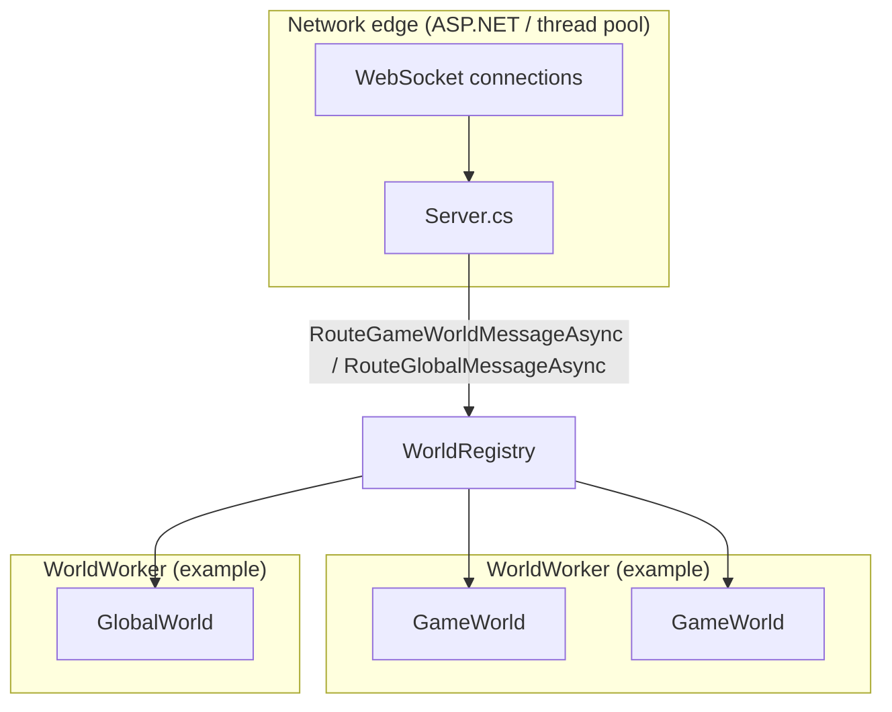
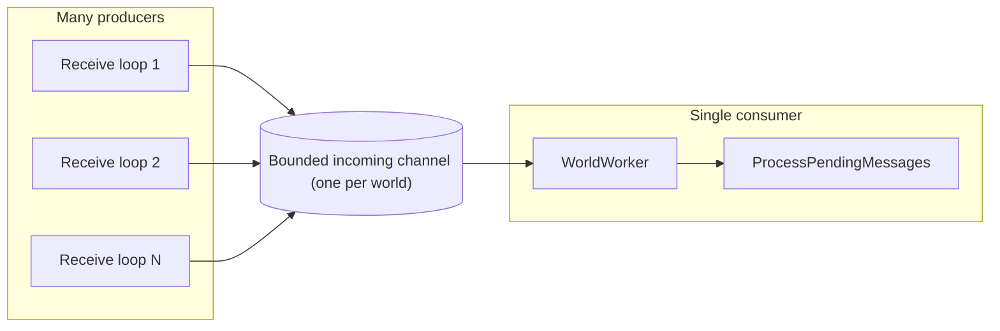
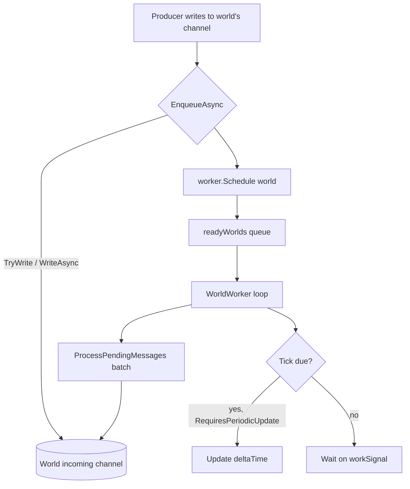
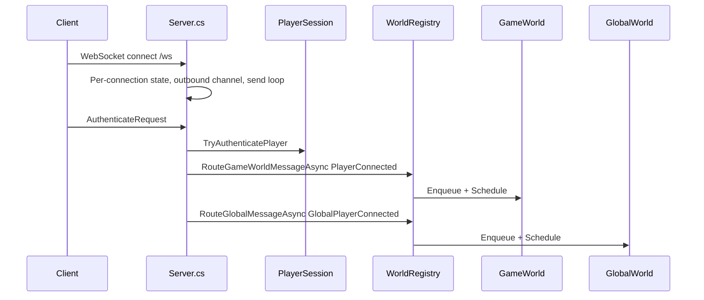
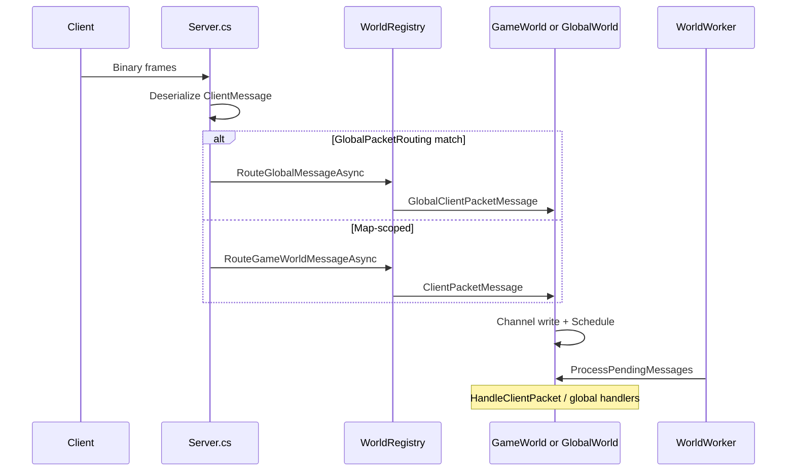
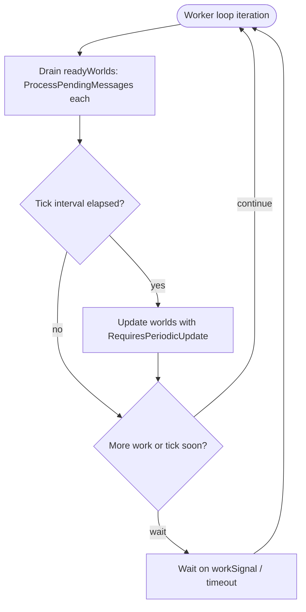
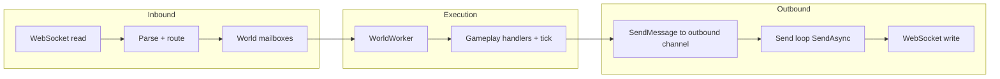

# Server Threading And Packet Flow

This document describes how the current server-side threading model works in `server/`, how packets move from WebSocket connections into playable `GameWorld` instances (and the singleton `GlobalWorld`), and how responses get back to the client.

## Goals

The current server design is built around these goals:

- Keep WebSocket receive handling lightweight.
- Keep mutable map gameplay state owned by a `GameWorld`, and cross-map concerns (today: chat) owned by `GlobalWorld`.
- Allow multiple `GameWorld` instances (and `GlobalWorld`) to run on the same long-running worker thread.
- Avoid fine-grained locks inside gameplay logic by ensuring a single consumer processes each world's mailbox.
- Make it straightforward to move players between worlds (world transfer is implemented; see `TransferPlayerInMessage` / `RunWorldTransferLoopAsync` in `Server.cs`).

### Architecture overview

At a high level, the network edge enqueues work into per-world mailboxes; each mailbox is drained only on its assigned `WorldWorker` thread.



## Main Components

### `Server.cs`

`server/Server.cs` owns the ASP.NET Core app, WebSocket endpoint setup, and per-connection socket lifecycle.

Responsibilities:

- Accept WebSocket connections.
- Enforce a short authentication phase: the first binary message must be `AuthenticateRequest`; until then, non-binary traffic is rejected and the receive loop uses `settings.Ping.Timeout` as a deadline.
- After authentication, attach the connection to a `PlayerSession` (stable `SessionId` / network id) and install outbound hooks on the session.
- Read incoming frames from the socket.
- Reassemble binary payloads into complete protobuf messages.
- Deserialize `ClientMessage`.
- Track which playable world the session occupies (`PlayerSession.CurrentGameWorldId`, updated on load and transfer).
- Route deserialized messages to `GlobalWorld` or the current `GameWorld` (see `GlobalPacketRouting` and `RouteClientPacketAsync`).
- Run a per-connection outbound send loop that serializes and writes frames under a `SemaphoreSlim` send lock.
- Run background loops for disconnect cleanup and world-transfer requests (`Channel<WorldTransferRequest>`).

`Server.cs` does not own gameplay logic. It acts as the network edge, session table, and message router.

### `WorldRegistry`

`server/World/WorldRegistry.cs` owns all registered playable worlds, the singleton global world, and all game-world worker threads.

Responsibilities:

- Create `WorldWorker` instances (`settings.Threads.GameWorldWorkers`) with tick interval `settings.GameWorld.TickInterval`.
- Start workers.
- Register `GameWorld` instances from config (`Config.LoadGameWorldsConfig()` in `Server.cs`), each pinned to a worker when `WorkerThread` is set, otherwise round-robin.
- Register a single `GlobalWorld`, optionally pinned via `settings.Threads.GlobalWorldWorkerThread`.
- Route `GameWorldMessage` to a world by id, or `GlobalWorldMessage` to the global mailbox.

This is the boundary between network routing and world execution.

### `WorldWorker`

`server/World/WorldWorker.cs` is a dedicated long-running OS thread that can host many `IWorkerWorld` instances (`GameWorld` and/or `GlobalWorld`).

Responsibilities:

- Own a thread with a loop that runs until shutdown.
- Receive scheduling signals when one of its worlds has new incoming mailbox work.
- Drain the `readyWorlds` queue and call `ProcessPendingMessages()` on each scheduled world.
- On a fixed interval, call `Update(deltaTime)` only on worlds with `RequiresPeriodicUpdate == true` (playable worlds tick; `GlobalWorld` does not).

A worker is a scheduler and executor. It is not the owner of gameplay state for all maps in one shared structure. Each world still owns its own state.

### `GlobalWorld`

`server/World/Global/GlobalWorld.cs` is the singleton mailbox-driven actor for server-wide features that are not tied to one map. It implements `IWorkerWorld` with `RequiresPeriodicUpdate => false`.

Responsibilities:

- Own a bounded `Channel<GlobalWorldMessage>` (same queue-size setting as playable worlds for the capacity).
- Track globally registered players (e.g. for chat).
- Handle `GlobalClientPacketMessage` payloads allowed by `GlobalPacketRouting` (currently `ChatMessageSendRequest`).

The network edge decides global vs map routing before enqueueing; handlers do not re-parse routing policy.

### `GameWorld`

`server/World/Game/GameWorld.cs` is the single-threaded owner of one map instance.

Responsibilities:

- Hold map-specific mutable state.
- Expose a per-world incoming message channel.
- Process connection, transfer, persistence, and packet events.
- Run scheduler jobs and monster AI on the worker tick (`Update` → `OnWorldTick`).
- Send responses back to player connections through `Action<ServerMessage>` hooks captured at connect time.

Each `GameWorld` has:

- `incomingMessages`: bounded `Channel<GameWorldMessage>` sized from `settings.GameWorld.IncomingMessagesQueueSize`
- `playersBySessionId` (and related indexes): active players known to the world
- `worker`: the `WorldWorker` that owns execution of this world

### `GameWorldMessage`

`server/World/Game/GameWorldMessage.cs` defines messages sent into a playable world's mailbox, including:

- `PlayerConnectedMessage` / `PlayerReconnectedMessage` / `PlayerDisconnectedMessage` / `RemoveDisconnectedPlayerMessage`
- `ClientPacketMessage`
- `SavePlayerStateRequestMessage`
- `TransferPlayerOutMessage` / `TransferPlayerInMessage`

This is the mailbox contract between the socket layer and the gameplay layer for map-scoped work.

### `GlobalWorldMessage`

`server/World/Global/GlobalWorldMessage.cs` defines the global mailbox contract (`GlobalPlayerConnectedMessage`, reconnect/disconnect/remove variants, `GlobalClientPacketMessage`).

### `GlobalPacketRouting`

`server/World/Global/GlobalPacketRouting.cs` is an allowlist of `ClientMessage` payload cases handled by `GlobalWorld` instead of `GameWorld`. Extend this when adding new cross-world packets.

## Threading Model

### Network Side

ASP.NET Core WebSocket handling is async. A single connection's receive loop is not tied to one permanent OS thread. After an `await`, execution may continue on a different thread-pool thread.

That is fine, because the design does not rely on a fixed "main thread".

What matters is:

- the WebSocket layer only reads, parses, authenticates, and routes
- each `GameWorld` owns mutable map state on its worker thread
- `GlobalWorld` owns its own mailbox-isolated state on its worker thread
- each `WorldWorker` ensures only one consumer drains a given world's mailbox

### World Side

Each `GameWorld` and `GlobalWorld` is attached to exactly one `WorldWorker`.

Important properties:

- a world has one reader for its incoming channel
- many producers may write to that channel
- only the assigned worker calls `ProcessPendingMessages()`
- only the assigned worker calls `Update()` when `RequiresPeriodicUpdate` is true

That means a world behaves like a single-threaded actor even though the rest of the server is concurrent.



## Multiple Worlds Per Thread

The implementation supports multiple `IWorkerWorld` instances on the same worker thread.

This is achieved by:

- giving every world its own incoming channel
- keeping a worker-level `readyWorlds` queue
- scheduling a world when its channel receives work (`EnqueueAsync` → `TryWrite` / `WriteAsync` + `worker.Schedule`)
- letting the worker drain scheduled worlds and call `ProcessPendingMessages()`
- running periodic `Update` ticks for worlds that need simulation (`GameWorld` yes, `GlobalWorld` no)

This keeps world ownership clean while avoiding one dedicated OS thread per map.



## Why The World Channel Is Bounded

`GameWorld` and `GlobalWorld` incoming channels are intentionally bounded (`BoundedChannelFullMode.Wait`, `SingleReader = true`, `SingleWriter = false`):

- they prevent unbounded memory growth if a world cannot keep up
- they apply backpressure to producers
- they make overload visible instead of silently buffering forever

Capacity comes from `Settings.json` → `gameWorld.incomingMessagesQueueSize`. When the fast `TryWrite` path fails, `EnqueueAsync` falls back to `WriteAsync`, which waits until space is available.

## Mailbox batching

`ProcessPendingMessages` drains at most `settings.GameWorld.IncomingMessagesBatchSizePerDispatch` messages per wake. If the channel still has items (`TryPeek`), the world is scheduled again so one flood of packets cannot starve other worlds on the same worker indefinitely.

## Why The Outgoing Socket Channel Is Separate

Each WebSocket connection has its own outbound queue in `Server.cs`.

Purpose:

- decouple producers (world threads) from the async send loop
- allow gameplay code to enqueue a `ServerMessage` without awaiting `WebSocket.SendAsync()`

Implementation notes:

- The queue is **`Channel.CreateUnbounded<ServerMessage>`** (`SingleReader = true`, `SingleWriter = false`). Gameplay uses `TryWrite`; slow clients can still grow memory—see limitations below.
- `SendOutgoingMessagesAsync` serializes protobuf to pooled buffers (optional zero-copy path via `settings.EnableZeroCopyProtobufTransfer`) and sends under `sendLock` so disconnect-close and normal sends do not interleave on the socket.

This avoids mixing gameplay execution with socket write timing while keeping the send path single-file per connection.

## Packet Flow

### Connection Open

When a client connects to `/ws`:

1. ASP.NET Core accepts the WebSocket.
2. `Server.cs` creates per-connection state: pooled receive buffers, an unbounded outbound channel, send loop + disconnect tasks, `SemaphoreSlim` send lock, and `currentGameWorldId` seeded from `settings.InitialMap` (spawn map may be randomized when `settings.SpawnToRandomMap` is enabled).
3. The receive loop waits for a binary `AuthenticateRequest`. Other message types before authentication close the connection with an error.
4. `TryAuthenticatePlayer` creates or reattaches a `PlayerSession` (`SessionId`, `NetworkId`, character name, optional reconnect within `settings.Timings.DisconnectTime`).
5. For a new session, persisted state may be loaded from disk and may override the spawn world via `ResolveLoadedPlayerJoin`.
6. Outbound hooks are stored on the session; `PlayerConnectedMessage` / `PlayerReconnectedMessage` is routed to the playable world, and `GlobalPlayerConnectedMessage` / `GlobalPlayerReconnectedMessage` to `GlobalWorld`.
7. `GameWorld` / `GlobalWorld` store the player and the callbacks used to queue `ServerMessage` responses and request disconnect or world change.



### Incoming Packet Path

For each incoming WebSocket message after authentication:

1. `ReceiveMessageAsync()` reads socket frames until `EndOfMessage`.
2. `Server.cs` handles close frames; non-binary frames are ignored once authenticated (during auth they fail the connection).
3. `Server.cs` deserializes the payload into `ClientMessage`.
4. Special cases like `LogoutRequest` / `LogoutCancelledRequest` may be handled in `Server.cs` before world routing.
5. Otherwise `RouteClientPacketAsync` either:
   - enqueues `GlobalClientPacketMessage` on `GlobalWorld`, or
   - enqueues `ClientPacketMessage(session.SessionId, clientMessage)` on the session's current `GameWorld` via `WorldRegistry.RouteGameWorldMessageAsync`.
6. `WorldRegistry` resolves the world by id and calls `EnqueueAsync` on that world.
7. The world writes to its bounded channel and calls `worker.Schedule(this)` when needed.
8. `WorldWorker` drains `readyWorlds` and calls `ProcessPendingMessages()` on the worker thread.
9. Map-scoped handlers run in `GameWorld` (e.g. `HandleClientPacket`); global handlers run in `GlobalWorld`.

At no point does `Server.cs` execute gameplay logic directly.



### Outgoing Packet Path

For a response generated inside a world:

1. The world looks up the player's connection object (or uses the session id it already has).
2. The world builds a `ServerMessage`.
3. The world invokes the connection's `SendMessage` callback (installed at connect time).
4. The callback `TryWrite`s the `ServerMessage` into the connection's outbound channel.
5. `SendOutgoingMessagesAsync()` reads from that channel, encodes protobuf, and calls `WebSocket.SendAsync()` under `sendLock`.

This keeps all actual socket writes in one place per connection.

```mermaid
sequenceDiagram
  participant W as GameWorld or GlobalWorld
  participant CB as SendMessage callback
  participant OQ as Outbound channel
  participant Loop as SendOutgoingMessagesAsync
  participant WS as WebSocket

  W->>W: Build ServerMessage
  W->>CB: Invoke callback
  CB->>OQ: TryWrite ServerMessage
  Loop->>OQ: Read
  Loop->>WS: SendAsync under sendLock
```

### Ping Example (map-scoped)

The ping flow is:

1. client sends protobuf `PingRequest`
2. `Server.cs` reads and parses it
3. `Server.cs` routes it to the player's current `GameWorld` (not global)
4. `GameWorld.HandleClientPacket()` matches `PingRequest`
5. `GameWorld` builds `PingResponse`
6. `GameWorld` enqueues the response via the per-connection callback
7. the per-connection send loop writes the bytes to the WebSocket

### Chat Example (global)

1. client sends `ChatMessageSendRequest`
2. `GlobalPacketRouting` selects `GlobalWorld`
3. `GlobalWorld` handles the chat request and sends responses via the same per-connection `SendMessage` path

## Worker Scheduling Model

Each `WorldWorker` loop:

1. Drains all worlds currently queued in `readyWorlds` (each runs `ProcessPendingMessages()`).
2. If the tick interval has elapsed, calls `Update(deltaTime)` on attached worlds that opt into periodic updates.
3. If there is no immediate mailbox work and the next tick is not yet due, waits on `workSignal` until new work is scheduled or the wait times out for the next tick.

The wait avoids busy-spinning while still waking promptly when `Schedule` sets the event.



## Why A World Is Explicitly Scheduled

Writing to the incoming channel is not enough by itself. The worker also needs to know that a specific world has work waiting.

That is why successful `TryWrite` (and completion of a waiting `WriteAsync`) is paired with `worker.Schedule(this)`.

The scheduling flag on each world:

- avoids enqueueing the same world into `readyWorlds` repeatedly
- allows many packets to accumulate in the inbox while only scheduling the world once
- reduces queue churn on the worker

## Why `SingleReader` And `SingleWriter` Matter

For channels, these options refer to concurrency, not permanent thread identity.

`SingleReader = true` means only one consumer reads from the channel at a time.

`SingleWriter = true` would mean only one producer writes at a time.

For world mailboxes:

- `SingleReader = true` is correct because only the assigned worker drains the inbox
- `SingleWriter = false` is correct because many WebSocket connection handlers may write into the same world concurrently

For the per-connection outbound queue:

- `SingleReader = true` is correct because only the send loop reads it
- `SingleWriter = false` matches the current code (multiple call sites could enqueue in the future; today the callback is the main producer)

## Ownership Rules

The intended ownership model is:

- `Server.cs` owns WebSocket lifetime, authentication, packet parsing, session tables, and transfer/cleanup loops
- `WorldRegistry` owns world registration and routing into mailboxes
- `WorldWorker` owns execution scheduling for attached worlds
- `GameWorld` owns map state and map-scoped gameplay logic
- `GlobalWorld` owns global mailbox state and global handlers

Code that mutates map state should live in `GameWorld`, not in `Server.cs`.

## Current Limitations

Deliberate or incomplete areas:

- Global routing is a static allowlist; new cross-world packets must be added to `GlobalPacketRouting` and handled in `GlobalWorld`.
- Per-connection outbound queues are **unbounded**; very slow clients can accumulate large `ServerMessage` queues in memory. There is send-side failure handling (`MaxConsecutiveOutboundSendFailures` / optional connection abort), but not a full slow-consumer policy on the channel itself.
- Operational metrics (queue depth histograms, tick duration) are still mostly log-oriented.

## Summary

The current server architecture follows this model:

- WebSocket handlers are producers into world mailboxes
- each `GameWorld` has its own bounded incoming channel; `GlobalWorld` has its own
- `WorldWorker` threads execute many worlds
- each world processes mailbox work and (for playable worlds) simulation ticks single-threadedly on its worker
- responses are enqueued to per-connection outbound channels and written by dedicated send loops under a send lock

This gives actor-like world isolation without requiring one OS thread per map, and keeps a clear seam for global features alongside map-scoped simulation.


