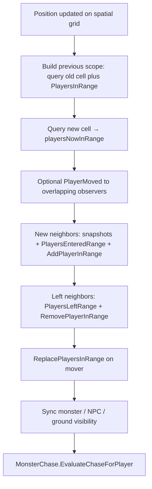
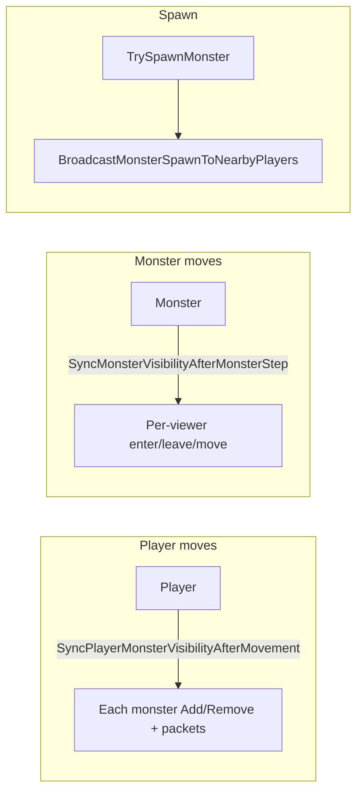

# Server visibility tracking

This document describes how a `GameWorld` maintains **which entities each connected player is told about** (players, monsters, NPCs, ground effects, and top-of-stack ground items), how those sets stay aligned with **spatial queries** after movement and spawns, and how **leave / join / transfer** paths clean up state. All of this runs on the world’s single worker thread (see `SERVER_THREADING_AND_PACKET_FLOW.md`). Client rendering is out of scope.

## View radius and spatial queries

Visibility is **server-authoritative** and uses a **rectangle** of cells around a center. Pick a center cell `centerX`, `centerY`. Another cell at `x`, `y` counts as visible when **both** of these hold:

- The horizontal distance from `centerX` is at most `ViewRadiusX` (same idea as “within `ViewRadiusX` cells to the left or right”).
- The vertical distance from `centerY` is at most `ViewRadiusY` (within `ViewRadiusY` cells up or down).

Those limits come from `SettingsConfig.Radius` in `Settings.json`, copied into `GameWorld` as `viewRadiusX` and `viewRadiusY` and passed into the spatial grids.

`PlayersSpatialGrid`, `MonstersSpatialGrid`, and `NpcsSpatialGrid` (`multiplayer/server/Utils/SpatialGrid.cs`) index entities in coarse cells sized from the view radii, query an axis-aligned **bounding box** around the center, then **filter** candidates so only cells inside that same rectangle are kept. `FillNearbyPlayersById` in `Movement` fills a dictionary from that query (with `excludeDisconnected: false` when building visibility sets so range membership stays consistent with the grid, including disconnect grace “ghosts” where applicable).

Ground effects and ground items use the same numeric bounds via `GroundStateVisibility.FillNearbyGroundEffectsById` and `FillNearbyGroundItemsById`, which ask `GroundStateTracker` for everything whose coordinates fall in that rectangle: from `centerX - ViewRadiusX` through `centerX + ViewRadiusX`, and from `centerY - ViewRadiusY` through `centerY + ViewRadiusY`, inclusive.

## Per-player authoritative sets (`GameWorldPlayer`)

`GameWorldPlayer` owns separate `HashSet<long>` collections—**one set per category**—representing what that session’s client is currently considered to “see” for sync purposes:

| Set | Meaning |
|-----|---------|
| `playersInRange` | Other player ids whose snapshots this client should track |
| `monstersInRange` | Monster instance ids in view |
| `npcsInRange` | NPC instance ids in view |
| `groundEffectsInRange` | Ground effect ids in view |
| `groundItemsInRange` | Top-of-stack ground item UIDs in view |

These are exposed read-only as `PlayersInRange`, `MonstersInRange`, etc., and updated through `Add*InRange`, `Remove*InRange`, and `Replace*InRange` helpers on `GameWorldPlayer` (`multiplayer/server/World/Game/GameWorldPlayer.cs`).

**Monsters are special:** `GameWorldMonster` also maintains `PlayersInRange`—the **mirror** of “which players currently have this monster in their `monstersInRange`.” That reverse set is used to fan out events (e.g. despawn) without scanning the whole map. NPCs do **not** maintain a symmetric per-viewer set; only the player side is tracked.

## Scratch buffers (`GameWorld` / `GameWorldRef`)

`GameWorld` allocates **reusable** dictionaries and hash sets (see `GameWorldRef` in `multiplayer/server/World/Game/GameWorld.cs`) and passes them through `gameWorldRef` into helpers. Visibility sync **diffs** “before” vs “after” using those scratch collections (e.g. `PlayersPreviouslyInRangeScratch`, `MonstersPreviouslyInRangeScratch`) so enumerations do not allocate per step and nothing is retained across `await` points.

## Player ↔ player visibility (movement and teleports)

After any authoritative position change, `Movement.SyncPlayerVisibilityAfterMovement` (`multiplayer/server/Helpers/Movement.cs`) runs with the **previous** cell coordinates `curX`, `curY` and the **destination** `destX`, `destY` (the player’s `PosX`/`PosY` are already updated on the grid).

High-level behavior:

1. **Reconstruct who was “in scope” before the move**  
   - Query nearby players at the **old** cell (excluding the mover’s session).  
   - **Union** that with `movedPlayer.PlayersInRange`.  
   This avoids missing neighbors when the move is a large jump (teleport): the old spatial query alone might not overlap everyone who still had the mover in their set.

2. **Who is in scope at the new cell**  
   Query nearby players at `destX`, `destY` → `playersNowInRange`.

3. **`PlayerMoved`**  
   If `broadcastPlayerMoved` is true, send `PlayerMoved` only to players who appear in **both** the previous and new neighborhood intersections (still able to observe the path). Disconnected sessions are skipped.

4. **New neighbors**  
   Players in `playersNowInRange` whose ids were **not** in the combined previous set receive bulk snapshots (`SendPlayersSnapshotsBulk`), then receive `PlayersEnteredRange` for the mover, and call `AddPlayerInRange(movedPlayer.PlayerId)` when connected.

5. **Left neighbors**  
   Ids in the previous set but **not** in `playersNowInRange` get `PlayersLeftRange` on the mover and on the former observers; observers call `RemovePlayerInRange(movedPlayer.PlayerId)`.

6. **Mover’s set**  
   `movedPlayer.ReplacePlayersInRange(playersNowInRange.Keys)`.

7. **Other layers**  
   `MonsterVisibility.SyncPlayerMonsterVisibilityAfterMovement`, `Npc.SyncPlayerNpcVisibilityAfterMovement`, `GroundStateVisibility.SyncPlayerGroundStateAfterMovement`, then `MonsterChase.EvaluateChaseForPlayer`.

Teleports and resurrection use the same helper with `playerMovedTeleport` or knockback paths may pass `broadcastPlayerMoved: false` when another packet already conveys motion to observers.

## Player ↔ monster visibility

### After a **player** moves

`MonsterVisibility.SyncPlayerMonsterVisibilityAfterMovement`:

- Snapshot `player.MonstersInRange` into scratch, query `MonsterSpatialGrid` at the player’s new cell → `monstersNow`.
- Compute **entered** and **left** lists; send `MonstersEnteredRange` / `MonstersLeftRange` to the player when connected.
- For each entered monster: `monster.AddPlayerInRange(playerId)`.
- For each left id: `monster.RemovePlayerInRange(playerId)` if the instance still exists.
- `player.ReplaceMonstersInRange(monstersNow.Keys)`.

### After a **monster** moves

`MonsterVisibility.SyncMonsterVisibilityAfterMonsterStep` compares **viewer sets** at the **previous** cell vs **new** cell (both queries use `excludeDisconnected: false` for consistent enumeration, then skip disconnected when sending):

- **`MonsterMoved`** to viewers present in **both** old and new neighborhoods (still watching the entity).
- **`MonstersEnteredRange`** for viewers **newly** in range; `viewer.AddMonsterInRange` + monster tracks the viewer.
- **`MonstersLeftRange`** for viewers who dropped out; `viewer.RemoveMonsterInRange`.
- `monster.ReplacePlayersInRange(newViewerIds)` and chase re-evaluation.

### Monster **spawn** (dwell, summon, respawn)

`GameWorld.TrySpawnMonster` ends with `MonsterVisibility.BroadcastMonsterSpawnToNearbyPlayers`. For each **connected** player near the spawn cell, if `!recipient.IsMonsterInRange(spawned.MonsterId)`, the server sends `MonstersEnteredRange`, updates the player’s set, and calls `spawned.AddPlayerInRange(recipient.PlayerId)`. Duplicates are skipped via `IsMonsterInRange`.

### Monster **despawn** (remove corpse, etc.)

`GameWorld.RemoveMonster` iterates `monster.PlayersInRange`, removes the monster from each viewer’s set, sends `MonstersLeftRange`, then `monster.ClearPlayersInRange` and removes the monster from maps and the spatial grid.

## NPC visibility

`Npc.SyncPlayerNpcVisibilityAfterMovement` mirrors the **player-side** monster diff (entered/left packets, `ReplaceNpcsInRange`) but **does not** maintain a reverse set on `GameWorldNPC`.

`Npc.SendNpcsInRangeOnPlayerJoin` bulk-sends NPCs near the joiner and replaces `NpcsInRange`. World construction can place NPCs with `SpawnWorldNpcAtCell` **before** any player is present—no visibility broadcast at placement time.

## Ground state visibility

`GroundStateVisibility.SyncPlayerGroundStateAfterMovement` diffs ground **effects** and **top-of-stack items** separately, then sends `GroundStatesLeftRange` / `GroundStatesEnteredRange` as needed and updates `ReplaceGroundEffectsInRange` / `ReplaceGroundItemsInRange`.

On join/reconnect, `SendGroundStatesInRangeOnPlayerJoin` sends one bulk `GroundStatesEnteredRange` when anything is visible.

Dynamic events (new effects, stack changes) use helpers such as `BroadcastGroundEffectsCreated`, `BroadcastGroundItemTopStateChanged`, and expiry paths like `BroadcastGroundEffectsRemoved`—each collects **nearby viewers** and updates their sets when they first see or lose an id.

## New player joining the map

`Spawn.CompletePlayerJoin` (`multiplayer/server/Helpers/Spawn.cs`), invoked from `GameWorld.HandlePlayerConnected` and `HandleTransferPlayerIn`, performs:

1. `SendInitialState` / `SendInitialGameWorldState` (not visibility sets per se, but establishes self state).
2. Optional spawn protection scheduling.
3. **Players:** `FillNearbyPlayersById` → `SendPlayersSnapshotsBulk` to the joiner → `PlayersEnteredRange` for the joiner to each connected neighbor → `nearbyPlayer.AddPlayerInRange(joiner)` → `joiner.ReplacePlayersInRange`.
4. **Monsters:** `MonsterVisibility.SendMonstersInRangeOnPlayerJoin` (bulk enter, `monster.AddPlayerInRange` per nearby monster, `ReplaceMonstersInRange`, chase evaluation).
5. **NPCs:** `Npc.SendNpcsInRangeOnPlayerJoin`.
6. **Ground:** `GroundStateVisibility.SendGroundStatesInRangeOnPlayerJoin`.

So existing players learn about the joiner via `PlayersEnteredRange`; the joiner learns about them via bulk snapshots. Mutual `playersInRange` updates happen only on the **neighbor** side for the joiner’s id (the joiner’s set is replaced wholesale).

## Reconnect

`HandlePlayerReconnected` re-sends initial payloads, refills nearby players, sends `PlayerReconnected` and bulk snapshots, `ReplacePlayersInRange`, then the same monster/NPC/ground **join** helpers as above to realign range sets after a potentially long disconnect.

## Leaving scope: disconnect, removal, transfer

- **Disconnect without immediate removal** (`HandlePlayerDisconnected` with `SessionRemainsActive`): connection is detached; if still in grace, nearby players may receive `PlayerDisconnected` (visibility sets are not fully torn down here—ghost remains on grid for range queries per `Movement` comments).
- **Final removal** (`HandleRemoveDisconnectedPlayer`): `UnlinkPlayerFromAllMonstersVisibility` clears monster mirrors and the player’s monster/NPC sets; `PlayersLeftRange` is sent to spatial neighbors and `RemovePlayerInRange` is called on them; occupancy and spatial index are cleared.
- **Transfer out** (`HandleTransferPlayerOut`): same unlink + neighbor `PlayersLeftRange` + grid removal as final removal.

`UnlinkPlayerFromAllMonstersVisibility` (`GameWorld.cs`) walks `player.MonstersInRange` and removes the player from each monster’s `PlayersInRange`, then clears the player’s monster and NPC range sets—ensuring no stale reverse links remain.

## Summary table

| Event | Primary code path | Player sets | Monster reverse |
|-------|-------------------|-------------|-----------------|
| Player steps / teleports | `Movement.SyncPlayerVisibilityAfterMovement` | Player diff + monster/NPC/ground sync | Updated in monster sync |
| Monster steps | `MonsterVisibility.SyncMonsterVisibilityAfterMonsterStep` | Per-viewer monster add/remove | `ReplacePlayersInRange` |
| Monster spawn | `BroadcastMonsterSpawnToNearbyPlayers` | Add if not already tracked | `AddPlayerInRange` |
| Monster remove | `GameWorld.RemoveMonster` | Remove + left packet | Cleared |
| Join / transfer in | `Spawn.CompletePlayerJoin` | Bulk + replace | `SendMonstersInRangeOnPlayerJoin` |
| Leave / transfer out | `HandleRemoveDisconnectedPlayer`, `HandleTransferPlayerOut` | Neighbor remove + unlink | Unlink |

Together, the **per-player hash sets**, **spatial grids**, **`GameWorldRef` scratch diffing**, and **monster-side `PlayersInRange`** keep network fan-out bounded to “who can see this cell” while staying consistent across movement, spawns, and lifecycle events.
