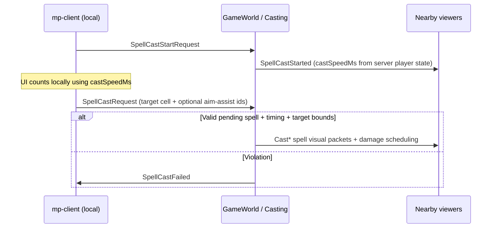
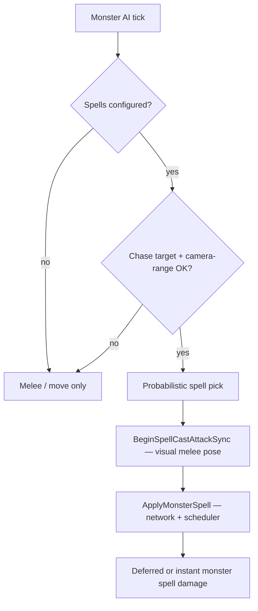

# Spell casting and delivery

This document describes how **spells** are requested, validated, shaped, and how **damage and crowd control** reach players and monsters. It covers **PvP**, **PvM**, **MvP**, and **MvM** from the server’s perspective, with **mp-client** (`multiplayer/mp-client`) noted only where it sends or renders protocol messages. Melee/bow combat is described in [COMBAT_SYSTEM.md](./COMBAT_SYSTEM.md).

**Primary code**: `multiplayer/server/Helpers/Casting.cs`, `multiplayer/server/Helpers/Combat.cs`, `multiplayer/server/World/Game/GameWorldPlayer.cs`, `multiplayer/server/World/Game/GameWorldMonster.cs`, `multiplayer/server/World/Game/GameWorld.cs` (ground-effect ticks), `multiplayer/server/Config.cs` (`SpellConfig`, `MonsterSpellEntry`), `multiplayer/server/Commons.cs` (`DamageType`, `AttackType`).

---

## Protocol: player casts (mp-client → server → clients)

The local player drives three client messages handled in `GameWorld`:

| Phase | Client message | Server handler | Fan-out |
|--------|----------------|----------------|---------|
| Begin casting | `SpellCastStartRequest` (`spellId`) | `Casting.HandleSpellCastStartRequest` | `SpellCastStarted` (`playerId`, `spellName`, `castSpeedMs`) to nearby players |
| Cancel | `SpellCastCancelRequest` | `Casting.HandleSpellCastCancelRequest` | `SpellCastCancelled` |
| Resolve (commit) | `SpellCastRequest` (`x`, `y`, optional `playerId` / `monsterId` for aim assist) | `Casting.HandleSpellCastRequest` | Authoritative cast packets (`CastAoeSpell`, `CastDirectionalAoeSpell`, ground-effect creation, etc.) |

mp-client sends these via `NetworkManager.sendSpellCastStartRequest`, `sendSpellCastCancelRequest`, and `sendSpellCastRequest` (`multiplayer/mp-client/src/utils/NetworkManager.ts`). The server **does not** trust client timing for when damage applies; it computes delays from config and `Settings.json` timings.

---

## Server-side checks (player `HandleSpellCastRequest`)

Before any spell effect runs, the server enforces:

1. **Alive** — dead players cannot cast.
2. **Pending selection** — `RequestedSpellId` must match a prior accepted `SpellCastStartRequest`; otherwise `SpellCastFailed` is sent and the event is logged as a violation.
3. **Catalog** — `spellId` must exist in `SpellsById` (from `Spells.json`).
4. **Cast timing** — `IsSpellCastTimingViolation`: elapsed time since `RecordSpellCastStartTimeMs` must be at least `ComputeMinRequiredTimeMs(CastSpeedMs)` (cast duration minus `timings.antiHackTimingLagFactor` and capped ping variance). Missing a recorded start counts as a violation. On failure: `SpellCastFailed`, pending spell cleared.
5. **Target clamp** — requested `(x, y)` must lie within axis-aligned **camera radius** from the caster (`Settings.json` → `radius.cameraRadiusX` / `cameraRadiusY`). On failure: `SpellCastFailed`.
6. **Aim assist** (optional) — if `SpellConfig.aimAssist` is true and the request carries `playerId` / `monsterId`, the target cell may snap to that entity’s position, with visibility/invisibility rules via `Casting.TryApplySpellAimAssist` (cannot snap to invisible targets unless `SpellAimAssist` allows it; self-target only allowed for buffs without `damageType`).

Successful resolution clears the pending spell and calls `TemporaryEffects.BreakInvisibilityIfPresent` on the caster.

**Spawn protection**: starting a cast clears the caster’s spawn protection (`HandleSpellCastStartRequest`), same idea as weapon combat.

**Interrupted casts**: if the caster takes damage with an `AttackType` other than `NoInterrupt`, `ClearSpellCastStateOnInterruptingDamage` clears both `requestedSpellId` and `lastSpellCastStartMs` (`GameWorldPlayer`, invoked from `MonsterVisibility.BroadcastCombatDamageToPlayer`). That cancels any “in progress” spell without a server `SpellCastCancelled` fan-out from this path.

---

## Spell configuration (`SpellConfig` / `Spells.json`)

Authoritative fields are documented on `SpellConfig` in `multiplayer/server/Config.cs`. Highlights:

| Field | Role |
|--------|------|
| `damageType` | Omit for **buff-only** spells (`temporaryEffects` only). Otherwise one of `DamageType` (see below). |
| `attackType` | Maps to `AttackType` for spell hits; **default `Interrupt`** when omitted. |
| `aoeRadius` | Chebyshev distance from spell **anchor** cell(s) for rectangle-style areas and ground-effect placement. |
| `projectileSpeed` / `projectileDistance` | For `RectangleAoe`, enables **projectile-delayed** damage using `Projectile` travel time (`timings.arrowSpeed`-style pixel math in code). |
| `emissionSteps`, `startRadius`, `endRadius`, `startShards`, `endShards` | **Cone** (`ConeAoe`) sampled circles; required for server cone geometry. |
| `duration` | **LinearAoe**: animation linger; server schedules damage at **`duration / 2`**. **GroundEffect**: effect lifetime. |
| `group`, `tickRate` | **GroundEffect**: stacking group and optional **periodic** damage; omit `tickRate` for step-on-only until expiry. |
| `aimAssist` | Enables optional aim-assist ids on `SpellCastRequest`. |
| `temporaryEffects` | On-hit (or per-tick for ground effects) timed effects. |

Startup validation: `Config.ValidateMonsterSpellReferences` ensures monster `spells[].spellId` entries reference real spells.

---

## `DamageType` shapes (numeric values in `Commons.cs`)

| Enum | Value | Server behavior (summary) |
|------|--------|-----------------------------|
| `RectangleAoe` | 0 | Anchor `(targetX, targetY)`, Chebyshev radius `aoeRadius`. Broadcast `CastAoeSpell`. If `projectileSpeed` set: **defer** damage by travel time and capture target **ids at cast time**; else **immediate** `ApplyRectangleSpellDamage` using **current** positions from spatial queries. |
| `ConeAoe` | 1 | `CastDirectionalAoeSpell`; builds cone cells; if valid, **defer** by `timings.blizzardSpellDamageDelayMs`; targets captured at cast time. |
| `LinearAoe` | 2 | Directional cast; thickened Bresenham beam ± optional target `aoeRadius` blob; if cells built and `duration` present, **defer** by `duration / 2`; targets captured at cast time. |
| `SingleCell` | 3 | Directional visual; **immediate** damage on exactly one cell (`aoeRadius` 0). |
| `GroundEffect` | 4 | No directed damage packet in `Casting` for the burst — places **per-cell** effects with caster snapshot (`caster.Damage`, resolved `AttackType`, tick rate, duration). See [Ground effects](#ground-effects). |

Buff-only spells (`damageType` omitted): directional buff visual + `TemporaryEffects.ResolveBuffSpellAtCell` and optional `CastEffect` for invisibility/berserk keys.

---

## Who can be hit (PvP, PvM, MvP, MvM)

The server does **not** use visibility sets (`IsPlayerInRange` / `IsMonsterInRange`) to accept spell casts; it uses **spatial queries** around the spell anchor or affected cells. Any **player** in the damaged area can be hit except:

- The **casting player** is excluded from their own **damage** spells (rectangle / cone / linear loops skip `caster.PlayerId`).

Any **monster** in the area can be hit, except the **casting monster** is excluded from its own **rectangle** AoE (`monsterId` equality check).

There is **no** allegiance filter inside `Casting` — a spell damages **all** valid entities in the shape (friends, neutrals, and hostiles alike) subject to the exclusions above and the delivery-time checks below.

**Rough matchup coverage**:

- **PvP / PvM** — player spells: `Combat.ApplyPlayerDamageToPlayer` / `ApplyPlayerDamageToMonster` → same paths as weapon damage for HP and CC fan-out (`ApplyPlayerAttackToPlayer` / `ApplyPlayerAttackToMonster` internally).
- **MvP** — monster spells: `Combat.ApplyMonsterSpellDamageToPlayer` (`PlayerReceiveDamage` / `BroadcastPlayerReceiveDamage` path).
- **MvM** — monster spells: `Combat.ApplyMonsterSpellDamageToMonster` → `TryResolveMonsterAttack` + `BroadcastMonsterTakeDamageByMonster`.

---

## Damage amount and `AttackType`

### Player casters

- **Spell damage amount** uses the caster’s authoritative **`GameWorldPlayer.Damage`** (same stat as weapon attacks), not a per-spell damage field in `SpellConfig`.
- **`AttackType`** for the spell comes from `SpellConfig.attackType` with default **`Interrupt`**. `Casting.ResolveSpellAttackType` maps **`GroundEffect` + `Knockback` → `Stun`** (ground fields do not knock players between cells the way directional spells do).

Stun/knockback on **players** uses `attacker.AttackStunDurationMs` and occupancy rules inside `ApplyPlayerAttackToPlayer` (same as COMBAT_SYSTEM).

### Monster casters

- **Spell damage roll**: `random.Next(AttackDamageMin, AttackDamageMax + 1)` — the same band as normal monster melee (`TryCastSpellAgainstChaseTarget`).
- **CC**: `ApplyMonsterSpellDamageToPlayer` / `ApplyMonsterSpellDamageToMonster` use the spell’s resolved `AttackType` with **`GameWorldMonster.StunDurationMs`** for stun-style outcomes; stun/knockback vs players can downgrade to **`Interrupt`** when the victim already has an active combat stunlock window (mirrors melee monster rules in `Combat`).

---

## Delivery timing: instant vs deferred, and “frozen” target lists

| Shape | When damage runs | Position semantics |
|--------|------------------|--------------------|
| Rectangle **without** projectile scheduling | Immediately | **Live** query: who is in the AoE **now** at cast resolution. |
| Rectangle **with** `projectileSpeed` | After projectile travel ms | **Snapshot**: player and monster **ids** collected at cast time; deferred callback only re-checks still-connected / alive / spawn protection, **not** whether they remain inside the AoE. |
| Cone | After `blizzardSpellDamageDelayMs` | **Snapshot** ids at cast time (same deferral behavior as above). |
| Linear | After `duration / 2` | **Snapshot** ids when cone/linear cell building succeeds. |
| Single cell | Immediate | Live query on that cell. |

Monster spell variants (`ApplyMonsterSpell`) mirror the same geometry and delay rules, using `CreateMonsterCastAoeSpell` / `CreateMonsterCastDirectionalAoeSpell` for visuals.

**On-hit extras**: after HP damage, `TemporaryEffects.ApplySpellTemporaryEffectsOnHit` applies spell `temporaryEffects` rows where applicable (and ground-effect tick/step logic applies debuffs per `Combat` helpers).

---

## Ground effects (player-only creation in this stack)

Player `DamageType.GroundEffect` spells call `ApplyGroundEffectSpell`: creates `GroundEffectState` instances on each covered cell (with `GroundEffectType` resolved **by spell id** in code — adding a new ground spell requires updating that switch), broadcasts creation via `GroundStateVisibility`, and registers tick/expiry callbacks on the world scheduler.

- **Periodic** (`tickRate` set): `GameWorld.HandleGroundEffectTick` applies `Combat.ApplyGroundEffectDamageToPlayer` / `ApplyGroundEffectDamageToMonster` to whoever **occupies** the cell at tick time (PvP + PvM + MvM).
- **Step-on** (no periodic): `Combat.ApplyGroundEffectStepDamageToPlayer` / `ApplyGroundEffectStepDamageToMonster` when an entity enters the cell (movement pipeline).

Damage per tick uses the **snapshot** stored on the effect (`DamagePerTick`, `SpellAttackType`, caster id), not a live re-read of caster stats at tick time.

---

## Monster spell casting (no player-style cast timing)

Monsters do **not** use `SpellCastStartRequest` / `SpellCastRequest` or `IsSpellCastTimingViolation`. AI calls `TryCastSpellAgainstChaseTarget` when a chase target exists and range/clamp checks pass:

- **Spell choice**: each `MonsterSpellEntry` (`spellId`, `castProbability`) — roll whether the entry fires, then pick uniformly among winners.
- **Synchronization with melee animation**: `BeginSpellCastAttackSync` sets attack state, faces the target, sets **`attackDamageDealDue = null`** (no melee damage), and broadcasts `MonsterAttacked` / `MonsterAttackedMonster` so clients play the normal attack pose and stop movement — but **spell damage is independent** of `AttackSpeedMs` / half-swing delivery.
- **No cast bar timing**: `GetEffectiveCastSpeedMsForBroadcast()` returns **`null`** for monsters, so there is no server-driven spell wind-up analogous to `SpellCastStarted`’s `castSpeedMs`.
- **Recovery gate**: like melee, `stayInIdleUntil` uses `AttackRecoveryMs + AttackSpeedMs / 2` after a spell, so spell attempts respect the same **idle / recovery** gating as weapon swings.

`Casting.ApplyMonsterSpell` supports the same **`DamageType`** cases as players except **buff-only** and **ground-effect** branches (the monster switch throws on unsupported types — monster spell ids should be damaging shapes only).

---

## Network / client presentation summary

- **Players**: cast visuals are driven by server messages (`SpellCastStarted`, `CastAoeSpell`, `CastDirectionalAoeSpell`, `CastEffect`, ground-effect create/remove). mp-client `CastManager` maps spell ids to **local VFX** (projectiles, blizzards, etc.); those are **cosmetic** relative to the server’s timing and shapes.
- **Monsters**: spell visuals use monster-specific payloads (`MonsterCastAoeSpell`, `MonsterCastDirectionalAoeSpell`, …) so viewers can attach VFX to `monsterId`.

---

## Settings cross-references (`server/Config/Settings.json`)

- **`timings.blizzardSpellDamageDelayMs`** — cone (`ConeAoe`) deferred damage.
- **`timings.arrowSpeed`** — used by `Projectile` helpers for rectangle projectile-delayed spells (named like bow speed, shared math).
- **`timings.knockbackTimeMs`** — knockback duration when spell `AttackType` resolves to knockback for **player-on-player** / relevant paths.
- **`timings.antiHackTimingLagFactor`** — folded into `ComputeMinRequiredTimeMs` for cast interval validation.
- **`radius.cameraRadiusX` / `cameraRadiusY`** — maximum spell target offset from caster.

---

## Summary table

| Matchup | Caster | Initiation | Damage API | Notes |
|---------|--------|------------|------------|--------|
| PvP / PvM | Player | `SpellCast*` messages | `ApplyPlayerDamageToPlayer` / `ApplyPlayerDamageToMonster` | Uses `Damage` + spell `AttackType`; caster excluded from own AoE. |
| MvP / MvM | Monster | AI `TryCastSpellAgainstChaseTarget` | `ApplyMonsterSpellDamageToPlayer` / `ApplyMonsterSpellDamageToMonster` | Rolled damage; no cast-speed validation; attack pose for sync only. |
| Ground field | Player | `ApplyGroundEffectSpell` | `ApplyGroundEffectDamageTo*` on tick or step | PvP + PvM + MvM on shared cells. |

---

## Related documentation

- [COMBAT_SYSTEM.md](./COMBAT_SYSTEM.md) — `AttackType`, interrupts, stunlock, non-spell delivery.
- [SERVER_VISIBILITY_TRACKING.md](./SERVER_VISIBILITY_TRACKING.md) — visibility sets (not used to gate spell *resolution*, but still relevant for what each client sees).
